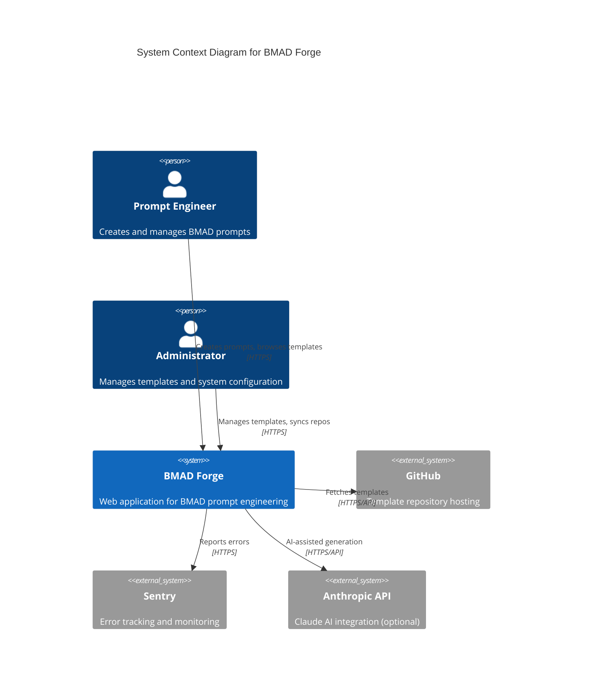
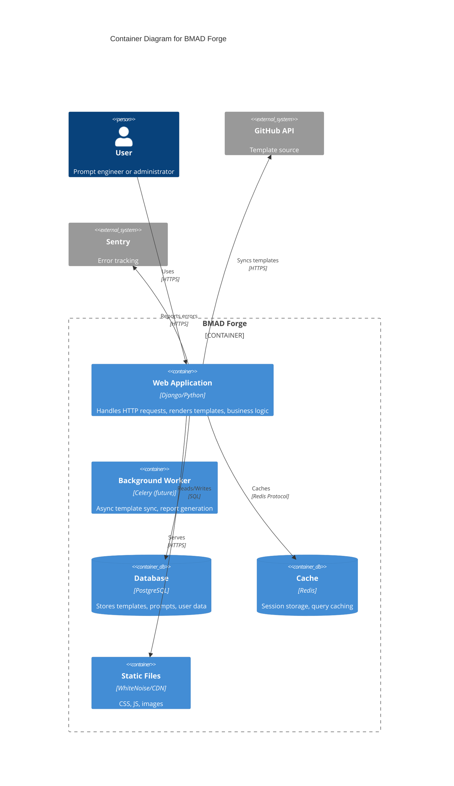
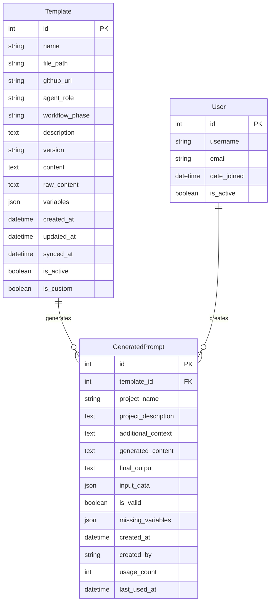
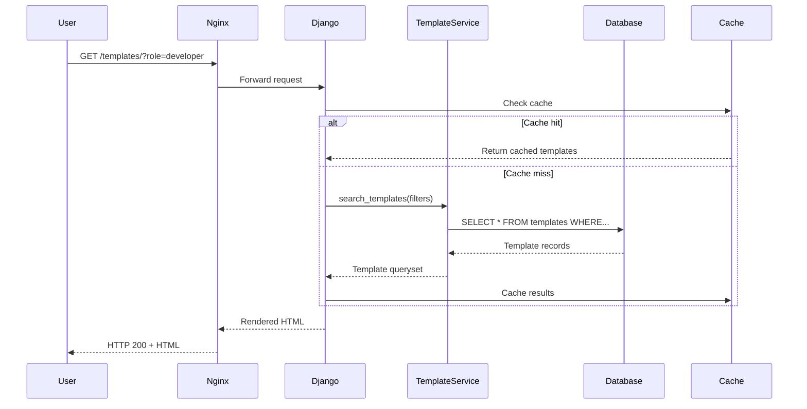
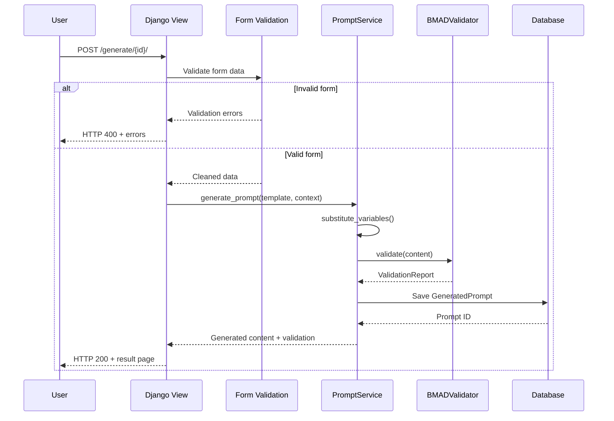
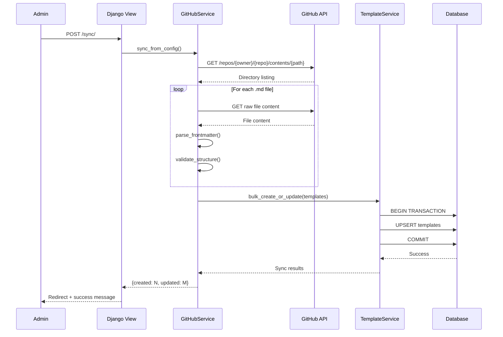
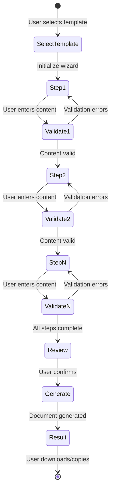
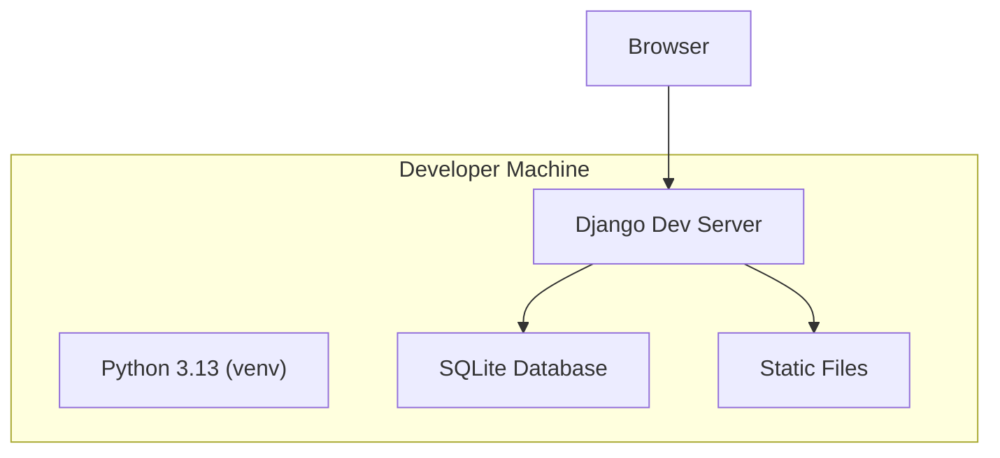
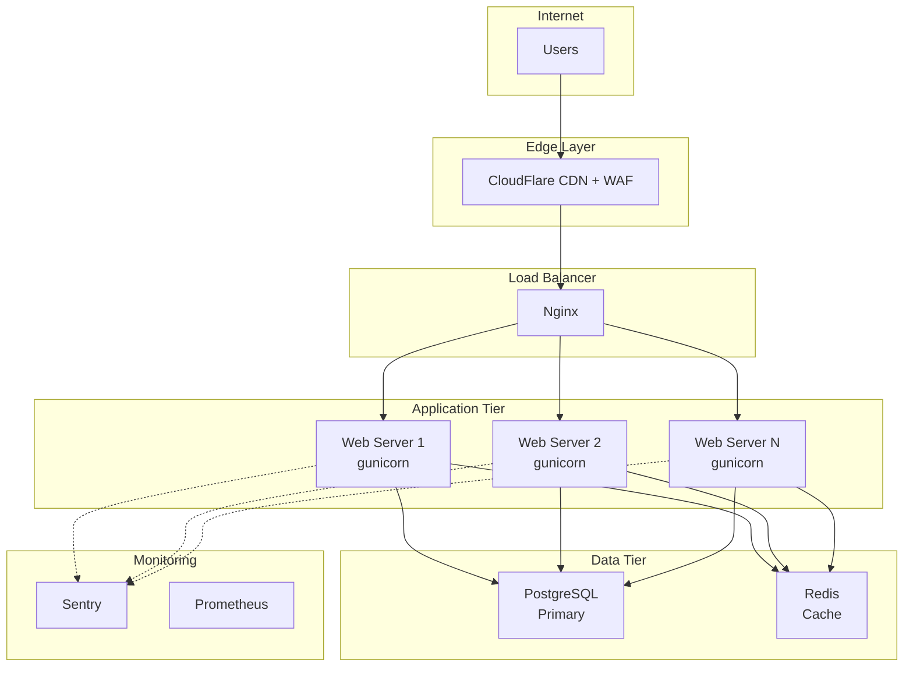
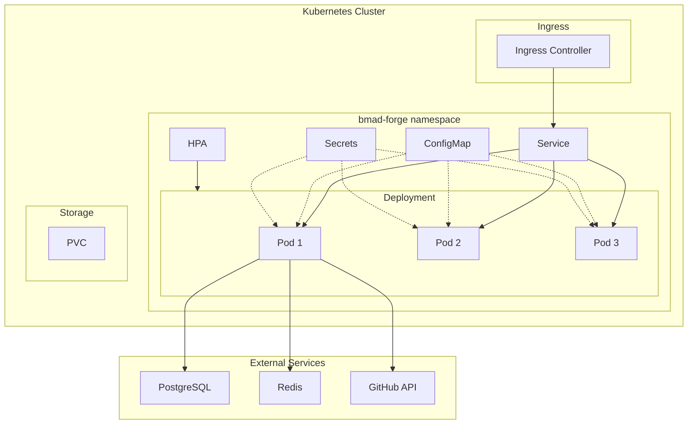

# BMAD Forge Architecture Documentation

## System Overview

**BMAD Forge** is a Django-based web application for managing and generating structured prompts for the BMAD (Business, Mission, Analysis, Design) Framework. It provides a user-friendly interface for accessing prompt templates from GitHub repositories and generating customized prompts for various agent roles and workflow phases.

## C4 Context Diagram



## C4 Container Diagram



## Technology Stack

### Backend
- **Framework:** Django 5.2.10 (LTS)
- **Language:** Python 3.13
- **WSGI Server:** gunicorn (production)
- **Database:** SQLite (development), PostgreSQL (production)
- **Caching:** Redis (production)

### Frontend
- **Template Engine:** Django Templates
- **CSS Framework:** Bootstrap 5
- **Forms:** django-widget-tweaks
- **JavaScript:** Vanilla JS (minimal)

### External Services
- **GitHub API:** Template repository access
- **Anthropic API:** Claude AI integration (optional)

### Infrastructure
- **Static Files:** WhiteNoise (production)
- **Monitoring:** Sentry (error tracking)
- **Security:** Django CSP, Permissions Policy

## Application Structure

```
BMAD_Forge/
├── webapp/                          # Django project root
│   ├── config.yaml                  # Application configuration file
│   ├── bmad_forge/                  # Project configuration
│   │   ├── config.py                # Configuration loader
│   │   ├── settings/                # Environment-specific settings
│   │   │   ├── __init__.py          # Auto-detect environment
│   │   │   ├── base.py              # Common settings
│   │   │   ├── development.py       # Development overrides
│   │   │   ├── production.py        # Production settings
│   │   │   └── test.py              # Test configuration
│   │   ├── urls.py                  # URL routing
│   │   ├── wsgi.py                  # WSGI application
│   │   └── asgi.py                  # ASGI application (future)
│   ├── forge/                       # Main application
│   │   ├── models.py                # Data models
│   │   ├── views.py                 # View controllers
│   │   ├── forms.py                 # Form definitions
│   │   ├── services.py              # Business logic
│   │   ├── urls.py                  # App-specific URLs
│   │   ├── admin.py                 # Admin interface
│   │   ├── templates/forge/         # HTML templates
│   │   ├── static/forge/            # CSS, JS, images
│   │   ├── management/commands/     # CLI commands
│   │   └── tests/                   # Test suite
│   ├── manage.py                    # Django management script
│   ├── requirements.txt             # Python dependencies
│   └── requirements-prod.txt        # Production dependencies
├── docs/                            # Documentation
│   ├── ARCHITECTURE.md              # This file
│   ├── DJANGO6_UPGRADE_PLAN.md      # Upgrade guide
│   ├── PRODUCTION_READINESS.md      # Deployment guide
│   ├── DEPLOYMENT_CHECKLIST.md      # Pre-deployment checklist
│   └── SECURITY_GUIDE.md            # Security hardening
├── .env.production.example          # Environment variables template
├── .github/workflows/ci.yml         # CI/CD pipeline
└── README.md                        # Project overview
```

## Data Models

### Entity Relationship Diagram



### Template

Represents a prompt template from the BMAD Framework.

```python
class Template(models.Model):
    """Prompt template from BMAD Framework"""

    # Identification
    name = CharField(max_length=200)
    file_path = CharField(max_length=500)
    github_url = URLField()

    # Metadata
    agent_role = CharField(max_length=50, choices=BMAD_AGENT_ROLES)
    workflow_phase = CharField(max_length=50, choices=BMAD_WORKFLOW_PHASES)
    description = TextField()
    version = CharField(max_length=20)

    # Content
    content = TextField()
    raw_content = TextField()

    # Timestamps
    created_at = DateTimeField(auto_now_add=True)
    updated_at = DateTimeField(auto_now=True)
    synced_at = DateTimeField(null=True)

    # Status
    is_active = BooleanField(default=True)
    is_custom = BooleanField(default=False)
```

**Relationships:**
- One-to-Many with GeneratedPrompt (one template generates many prompts)

**Indexes:**
- `agent_role` - Fast filtering by role
- `workflow_phase` - Fast filtering by phase
- `is_active` - Exclude inactive templates

### GeneratedPrompt

Stores user-generated prompts for history and reuse.

```python
class GeneratedPrompt(models.Model):
    """User-generated prompt instance"""

    # Relationships
    template = ForeignKey(Template, on_delete=CASCADE)

    # Input Parameters
    project_name = CharField(max_length=200)
    project_description = TextField()
    additional_context = TextField(blank=True)

    # Output
    generated_content = TextField()

    # Metadata
    created_at = DateTimeField(auto_now_add=True)
    created_by = CharField(max_length=100, blank=True)

    # Usage tracking
    usage_count = IntegerField(default=0)
    last_used_at = DateTimeField(null=True)
```

**Relationships:**
- Many-to-One with Template

**Indexes:**
- `created_at` - Chronological sorting
- `template_id` - Fast template lookup

## Service Layer

### ConfigLoader

Handles application configuration loading from `config.yaml` with environment variable overrides.

**Configuration File Structure:**
```yaml
application:
  version: "1.2.0"
  name: "BMAD Forge"

templates:
  local_path: "forge/templates/agents"
  github:
    repository: "DXCSithlordPadawan/BMAD_Forge"
    branch: "main"
    remote_path: "webapp/forge/templates"
  sync:
    overwrite_existing: true
    match_by: "title"
```

**Key Methods:**
```python
class ConfigLoader:
    @classmethod
    def load_config(cls, reload: bool = False) -> Dict:
        """Load configuration from config.yaml with caching"""

    @classmethod
    def get(cls, key_path: str, default: Any = None) -> Any:
        """Get config value by dot-separated path (e.g., 'application.version')"""

    @classmethod
    def reset(cls) -> None:
        """Reset cached configuration (useful for testing)"""
```

**Environment Override Precedence:**
1. Environment variables (highest priority)
2. config.yaml file values
3. Default values in code (lowest priority)

### GitHubService

Handles all GitHub API interactions.

**Responsibilities:**
- Fetch template files from repositories
- Recursive directory traversal for templates in subfolders (with depth protection)
- Parse TOML frontmatter
- Handle authentication (GitHub token)
- Rate limit management
- Error handling and retries

**Key Methods:**
```python
class GitHubSyncService:
    def fetch_templates(self, repo: str) -> List[Template]:
        """Fetch all templates from GitHub repository"""

    def fetch_directory_contents_recursive(
        self, owner: str, repo: str, branch: str, path: str,
        _current_depth: int = 0, _visited_paths: set = None
    ) -> List[Dict]:
        """Recursively fetch all files from directory and subdirectories"""

    def fetch_file_content(url: str) -> str:
        """Fetch raw file content from GitHub"""

    def parse_toml_frontmatter(content: str) -> dict:
        """Extract TOML metadata from markdown file"""

    def validate_template(template: dict) -> bool:
        """Validate template has required sections"""
```

### TemplateService

Business logic for template management.

**Responsibilities:**
- Template CRUD operations
- Template validation
- Custom template handling
- Template versioning
- Search and filtering

**Key Methods:**
```python
class TemplateService:
    def sync_from_github() -> int:
        """Sync templates from GitHub repositories"""

    def create_custom_template(data: dict) -> Template:
        """Create user-uploaded custom template"""

    def validate_template_structure(content: str) -> List[str]:
        """Validate template has required BMAD sections"""

    def search_templates(filters: dict) -> QuerySet:
        """Search templates by role, phase, keywords"""
```

### PromptGenerationService

Handles prompt generation logic.

**Responsibilities:**
- Merge template with user input
- Variable substitution
- Validation of generated prompts
- History tracking

**Key Methods:**
```python
class PromptGenerationService:
    def generate_prompt(template: Template, context: dict) -> str:
        """Generate prompt from template and user context"""

    def substitute_variables(content: str, context: dict) -> str:
        """Replace template variables with user values"""

    def save_generated_prompt(template: Template, content: str) -> GeneratedPrompt:
        """Save generated prompt to history"""
```

## Request Flow

### Template List View



### Prompt Generation Flow



### GitHub Sync Flow



### Document Generation Wizard Flow



### Legacy ASCII Flow (for reference)

```
Admin Trigger → sync_templates() view
    ↓
GitHubService.fetch_templates(BMAD_METHOD_REPO)
    ↓
For each template file:
    - Fetch raw content
    - Parse TOML frontmatter
    - Validate structure
    - Create/Update Template model
    ↓
TemplateService.create_or_update(template_data)
    ↓
Database Transaction (bulk create/update)
    ↓
Redirect to Template List with success message
```

## Security Architecture

### Authentication & Authorization

- **Admin Interface:** Django's built-in admin authentication
- **User Access:** Public access to template browsing (no auth required for MVP)
- **Future:** OAuth integration for GitHub authentication

### Security Headers (Production)

```python
# HTTPS Enforcement
SECURE_SSL_REDIRECT = True
SESSION_COOKIE_SECURE = True
CSRF_COOKIE_SECURE = True

# HSTS (HTTP Strict Transport Security)
SECURE_HSTS_SECONDS = 31536000
SECURE_HSTS_INCLUDE_SUBDOMAINS = True
SECURE_HSTS_PRELOAD = True

# XSS Protection
SECURE_BROWSER_XSS_FILTER = True
SECURE_CONTENT_TYPE_NOSNIFF = True
X_FRAME_OPTIONS = 'DENY'

# Content Security Policy
CSP_DEFAULT_SRC = ("'self'",)
CSP_SCRIPT_SRC = ("'self'", "'unsafe-inline'")
CSP_STYLE_SRC = ("'self'", "'unsafe-inline'")
```

### Input Validation

- **Forms:** Django form validation for all user inputs
- **Template Upload:** TOML parsing with error handling
- **SQL Injection:** Django ORM prevents SQL injection
- **XSS:** Django template auto-escaping enabled

### Secret Management

- **Environment Variables:** Secrets stored in `.env` files (not in git)
- **SECRET_KEY:** Cryptographically secure, rotated regularly
- **GitHub Token:** Personal access token with minimal permissions
- **Database Password:** Strong password, environment-specific

### Rate Limiting

- **GitHub API:** Respect rate limits (5000 requests/hour)
- **Form Submissions:** CSRF protection on all POST requests
- **Future:** Django Ratelimit middleware for API endpoints

## Deployment Architecture

### Development Environment



### Production Environment



### Kubernetes Deployment



### Static File Serving

**Development:**
- Django Dev Server serves static files directly
- STATIC_URL = '/static/'
- STATICFILES_DIRS = [BASE_DIR / 'forge' / 'static']

**Production:**
- WhiteNoise middleware serves static files
- Files collected to STATIC_ROOT during deployment
- Compression and caching headers enabled

```bash
# Collect static files
python manage.py collectstatic --noinput
```

### Database

**Development:**
- SQLite for simplicity
- Single file database (db.sqlite3)
- No configuration needed

**Production:**
- PostgreSQL 15+
- Connection pooling (CONN_MAX_AGE=600)
- Read replicas for scaling (future)
- Automated backups (daily)

### Caching Strategy

**Development:**
- No caching (dummy cache backend)

**Production:**
- Redis for session storage
- Cache template rendering
- Cache GitHub API responses (15 minutes)
- Cache database queries (5 minutes)

```python
CACHES = {
    'default': {
        'BACKEND': 'django_redis.cache.RedisCache',
        'LOCATION': os.environ.get('REDIS_URL'),
        'OPTIONS': {
            'CLIENT_CLASS': 'django_redis.client.DefaultClient',
        }
    }
}
```

## Monitoring and Observability

### Logging

**Log Levels:**
- DEBUG: Development only
- INFO: Application events (template sync, prompt generation)
- WARNING: Non-critical issues (GitHub API rate limit approaching)
- ERROR: Application errors (GitHub API failure, database errors)
- CRITICAL: System failures (database unavailable)

**Log Destinations:**
- Development: Console output
- Production: File + Sentry + CloudWatch/Stackdriver

**Example Configuration:**
```python
LOGGING = {
    'version': 1,
    'disable_existing_loggers': False,
    'formatters': {
        'verbose': {
            'format': '{levelname} {asctime} {module} {message}',
            'style': '{',
        },
    },
    'handlers': {
        'file': {
            'level': 'INFO',
            'class': 'logging.handlers.RotatingFileHandler',
            'filename': '/var/log/bmad-forge/app.log',
            'maxBytes': 10485760,  # 10MB
            'backupCount': 5,
            'formatter': 'verbose',
        },
        'sentry': {
            'level': 'ERROR',
            'class': 'sentry_sdk.integrations.logging.EventHandler',
        },
    },
    'loggers': {
        'django': {
            'handlers': ['file', 'sentry'],
            'level': 'INFO',
            'propagate': False,
        },
        'forge': {
            'handlers': ['file', 'sentry'],
            'level': 'INFO',
            'propagate': False,
        },
    },
}
```

### Health Checks

**Endpoint:** `/health/`

**Checks:**
- Database connectivity
- Redis connectivity (production)
- Disk space (warn if < 10% free)
- Memory usage (warn if > 80%)

**Response:**
```json
{
  "status": "healthy",
  "checks": {
    "database": "ok",
    "cache": "ok",
    "disk_space": "ok",
    "memory": "ok"
  },
  "timestamp": "2026-01-28T12:00:00Z"
}
```

### Error Tracking

**Sentry Integration:**
- Automatic exception tracking
- User context (if authenticated)
- Request context (URL, method, headers)
- Breadcrumbs (navigation, API calls)
- Release tracking (git commit SHA)

**Performance Monitoring:**
- Transaction tracing
- Database query performance
- External API call timing
- Frontend performance (future)

## Scalability Considerations

### Current Capacity

- **Concurrent Users:** ~100 users
- **Database:** SQLite (development) / PostgreSQL (production)
- **Static Files:** WhiteNoise (single server)

### Scaling Strategy

**Horizontal Scaling (when needed):**
1. Add application servers behind load balancer
2. Shared PostgreSQL database
3. Shared Redis cache
4. Static files on CDN

**Vertical Scaling (immediate):**
1. Increase gunicorn workers
2. Tune PostgreSQL connection pool
3. Optimize database queries
4. Add database indexes

**Bottlenecks:**
- GitHub API rate limits (5000/hour per token)
- Database write contention (GitHub sync)
- Static file serving (mitigated by WhiteNoise)

## Future Architecture Enhancements

### Short Term (3-6 months)
- [ ] Add API endpoints (REST API)
- [ ] Implement user authentication
- [ ] Add rate limiting
- [ ] Migrate to CDN for static files

### Medium Term (6-12 months)
- [ ] Real-time collaboration (WebSockets)
- [ ] Background job processing (Celery)
- [ ] Full-text search (Elasticsearch)
- [ ] API versioning

### Long Term (12+ months)
- [ ] Microservices architecture
- [ ] GraphQL API
- [ ] Kubernetes deployment
- [ ] Multi-region deployment

## Technology Decisions

### Why Django?

- **Rapid Development:** Built-in admin, ORM, templates
- **Security:** CSRF, XSS, SQL injection protection
- **Scalability:** Proven at scale (Instagram, Pinterest)
- **Ecosystem:** Rich library ecosystem
- **LTS Support:** Django 5.2 supported until 2027

### Why SQLite → PostgreSQL?

- **Development:** SQLite for zero-configuration setup
- **Production:** PostgreSQL for reliability, performance, features
- **Migration Path:** Django ORM abstracts database differences

### Why WhiteNoise?

- **Simplicity:** No separate static file server needed
- **Performance:** Gzip compression, cache headers
- **Cost:** No CDN costs initially
- **Upgrade Path:** Easy migration to CDN later

### Why Redis?

- **Sessions:** Fast session storage
- **Caching:** High-performance cache backend
- **Future:** Task queue (Celery), real-time features

## Development Workflow

### Local Development

```bash
# Set up environment
python -m venv venv
source venv/bin/activate
pip install -r requirements.txt

# Configure environment
cp .env.example .env
# Edit .env with local settings

# Run migrations
python manage.py migrate

# Create superuser
python manage.py createsuperuser

# Run development server
python manage.py runserver
```

### Testing

```bash
# Run all tests
pytest --cov=forge --cov-report=html

# Run specific test
pytest webapp/forge/tests/test_services.py::test_template_sync

# Run with warnings
python -Wa manage.py test
```

### Deployment

```bash
# Collect static files
python manage.py collectstatic --noinput

# Run migrations
python manage.py migrate --noinput

# Check deployment settings
python manage.py check --deploy

# Start gunicorn
gunicorn bmad_forge.wsgi:application --bind 0.0.0.0:8000
```

## Conclusion

BMAD Forge follows Django best practices with a clear separation of concerns:
- **Models** handle data persistence
- **Services** contain business logic
- **Views** orchestrate request handling
- **Templates** render HTML responses

The architecture prioritizes:
- **Simplicity:** Easy to understand and maintain
- **Security:** Defense in depth, secure by default
- **Scalability:** Horizontal and vertical scaling paths
- **Observability:** Comprehensive logging and monitoring

For questions or clarifications, refer to:
- Django Documentation: https://docs.djangoproject.com/
- BMAD Framework: https://github.com/bmadcode/BMAD-METHOD-v5
- Project README: /home/sithlord/src/BMAD_Forge/README.md
