# BMAD Forge Architecture Documentation

**Version:** 1.2.0  
**Last Updated:** February 2, 2026  
**Status:** Production Ready

## System Overview

**BMAD Forge** is a Django-based web application for managing and generating structured prompts for the BMAD (Business, Mission, Analysis, Design) Framework. It provides a user-friendly interface for accessing prompt templates from GitHub repositories and generating customized prompts for various agent roles and workflow phases.

### New in v1.2.0: Inline Editing Feature

The application now includes **step-by-step inline editing with rich text support**, allowing users to:
- Edit section headings and content with full formatting
- Use a rich text editor (Quill.js) with Markdown output
- Customize every aspect of templates while maintaining BMAD compliance
- Benefit from real-time validation and guidance
- Access enhanced security with multi-layer XSS prevention

## C4 Context Diagram


## C4 Container Diagram


## Technology Stack

### Backend
- **Framework:** Django 5.2.10 (LTS)
- **Language:** Python 3.13
- **WSGI Server:** gunicorn (production)
- **Database:** SQLite (development), PostgreSQL (production)
- **Caching:** Redis (production)

### Frontend
- **Template Engine:** Django Templates
- **CSS Framework:** Bootstrap 5
- **Rich Text Editor:** Quill.js 1.3.7 (via CDN) ⭐ NEW
- **Forms:** django-widget-tweaks
- **JavaScript:** Vanilla JS + custom wizard-editor.js ⭐ NEW

### External Services
- **GitHub API:** Template repository access
- **Anthropic API:** Claude AI integration (optional)

### Infrastructure
- **Static Files:** WhiteNoise (production)
- **Monitoring:** Sentry (error tracking)
- **Security:** Django CSP, Permissions Policy

## Application Structure

```
BMAD_Forge/
├── webapp/                          # Django project root
│   ├── config.yaml                  # Application configuration file
│   ├── bmad_forge/                  # Project configuration
│   │   ├── config.py                # Configuration loader
│   │   ├── settings/                # Environment-specific settings
│   │   │   ├── __init__.py          # Auto-detect environment
│   │   │   ├── base.py              # Common settings
│   │   │   ├── development.py       # Development overrides
│   │   │   ├── production.py        # Production settings
│   │   │   └── test.py              # Test configuration
│   │   ├── urls.py                  # URL routing
│   │   ├── wsgi.py                  # WSGI application
│   │   └── asgi.py                  # ASGI application (future)
│   ├── forge/                       # Main application
│   │   ├── models.py                # Data models
│   │   ├── views.py                 # View controllers
│   │   ├── forms.py                 # Form definitions
│   │   ├── services.py              # Business logic
│   │   ├── urls.py                  # App-specific URLs
│   │   ├── admin.py                 # Admin interface
│   │   ├── templates/forge/         # HTML templates
│   │   ├── static/forge/            # CSS, JS, images
│   │   ├── management/commands/     # CLI commands
│   │   └── tests/                   # Test suite
│   ├── manage.py                    # Django management script
│   ├── requirements.txt             # Python dependencies
│   └── requirements-prod.txt        # Production dependencies
├── docs/                            # Documentation
│   ├── ARCHITECTURE.md              # This file
│   ├── DJANGO6_UPGRADE_PLAN.md      # Upgrade guide
│   ├── PRODUCTION_READINESS.md      # Deployment guide
│   ├── DEPLOYMENT_CHECKLIST.md      # Pre-deployment checklist
│   └── SECURITY_GUIDE.md            # Security hardening
├── .env.production.example          # Environment variables template
├── .github/workflows/ci.yml         # CI/CD pipeline
└── README.md                        # Project overview
```

## Data Models

### Entity Relationship Diagram


### Template

Represents a prompt template from the BMAD Framework.

```python
class Template(models.Model):
    """Prompt template from BMAD Framework"""

    # Identification
    name = CharField(max_length=200)
    file_path = CharField(max_length=500)
    github_url = URLField()

    # Metadata
    agent_role = CharField(max_length=50, choices=BMAD_AGENT_ROLES)
    workflow_phase = CharField(max_length=50, choices=BMAD_WORKFLOW_PHASES)
    description = TextField()
    version = CharField(max_length=20)

    # Content
    content = TextField()
    raw_content = TextField()

    # Timestamps
    created_at = DateTimeField(auto_now_add=True)
    updated_at = DateTimeField(auto_now=True)
    synced_at = DateTimeField(null=True)

    # Status
    is_active = BooleanField(default=True)
    is_custom = BooleanField(default=False)
```

**Relationships:**
- One-to-Many with GeneratedPrompt (one template generates many prompts)

**Indexes:**
- `agent_role` - Fast filtering by role
- `workflow_phase` - Fast filtering by phase
- `is_active` - Exclude inactive templates

### GeneratedPrompt

Stores user-generated prompts for history and reuse.

```python
class GeneratedPrompt(models.Model):
    """User-generated prompt instance"""

    # Relationships
    template = ForeignKey(Template, on_delete=CASCADE)

    # Input Parameters
    project_name = CharField(max_length=200)
    project_description = TextField()
    additional_context = TextField(blank=True)

    # Output
    generated_content = TextField()

    # Metadata
    created_at = DateTimeField(auto_now_add=True)
    created_by = CharField(max_length=100, blank=True)

    # Usage tracking
    usage_count = IntegerField(default=0)
    last_used_at = DateTimeField(null=True)
```

**Relationships:**
- Many-to-One with Template

**Indexes:**
- `created_at` - Chronological sorting
- `template_id` - Fast template lookup

## Service Layer

### ConfigLoader

Handles application configuration loading from `config.yaml` with environment variable overrides.

**Configuration File Structure:**
```yaml
application:
  version: "1.2.0"
  name: "BMAD Forge"

templates:
  local_path: "forge/templates/agents"
  github:
    repository: "DXCSithlordPadawan/BMAD_Forge"
    branch: "main"
    remote_path: "webapp/forge/templates"
  sync:
    overwrite_existing: true
    match_by: "title"
```

**Key Methods:**
```python
class ConfigLoader:
    @classmethod
    def load_config(cls, reload: bool = False) -> Dict:
        """Load configuration from config.yaml with caching"""

    @classmethod
    def get(cls, key_path: str, default: Any = None) -> Any:
        """Get config value by dot-separated path (e.g., 'application.version')"""

    @classmethod
    def reset(cls) -> None:
        """Reset cached configuration (useful for testing)"""
```

**Environment Override Precedence:**
1. Environment variables (highest priority)
2. config.yaml file values
3. Default values in code (lowest priority)

### GitHubService

Handles all GitHub API interactions.

**Responsibilities:**
- Fetch template files from repositories
- Recursive directory traversal for templates in subfolders (with depth protection)
- Parse TOML frontmatter
- Handle authentication (GitHub token)
- Rate limit management
- Error handling and retries

**Key Methods:**
```python
class GitHubSyncService:
    def fetch_templates(self, repo: str) -> List[Template]:
        """Fetch all templates from GitHub repository"""

    def fetch_directory_contents_recursive(
        self, owner: str, repo: str, branch: str, path: str,
        _current_depth: int = 0, _visited_paths: set = None
    ) -> List[Dict]:
        """Recursively fetch all files from directory and subdirectories"""

    def fetch_file_content(url: str) -> str:
        """Fetch raw file content from GitHub"""

    def parse_toml_frontmatter(content: str) -> dict:
        """Extract TOML metadata from markdown file"""

    def validate_template(template: dict) -> bool:
        """Validate template has required sections"""
```

### TemplateService

Business logic for template management.

**Responsibilities:**
- Template CRUD operations
- Template validation
- Custom template handling
- Template versioning
- Search and filtering

**Key Methods:**
```python
class TemplateService:
    def sync_from_github() -> int:
        """Sync templates from GitHub repositories"""

    def create_custom_template(data: dict) -> Template:
        """Create user-uploaded custom template"""

    def validate_template_structure(content: str) -> List[str]:
        """Validate template has required BMAD sections"""

    def search_templates(filters: dict) -> QuerySet:
        """Search templates by role, phase, keywords"""
```

### PromptGenerationService

Handles prompt generation logic.

**Responsibilities:**
- Merge template with user input
- Variable substitution
- Validation of generated prompts
- History tracking

**Key Methods:**
```python
class PromptGenerationService:
    def generate_prompt(template: Template, context: dict) -> str:
        """Generate prompt from template and user context"""

    def substitute_variables(content: str, context: dict) -> str:
        """Replace template variables with user values"""

    def save_generated_prompt(template: Template, content: str) -> GeneratedPrompt:
        """Save generated prompt to history"""
```

### DocumentGenerator Service ⭐ NEW (v1.2.0)

**Enhanced for inline editing with rich text support.**

**New Responsibilities (v1.2.0):**
- HTML to Markdown conversion
- Multi-layer content sanitization  
- Editable content generation with structured data
- XSS prevention (4 layers)
- Real-time validation

**Key Methods (NEW):**
```python
class DocumentGenerator:
    @classmethod
    def generate_document_with_editable_content(
        cls, 
        template_content: str,
        edited_sections: Dict[str, Dict[str, str]],
        variable_data: Dict[str, str]
    ) -> Tuple[str, Dict]:
        """
        Generate document with user-edited sections.
        
        Args:
            template_content: Original template markdown
            edited_sections: {
                'Section Name': {
                    'heading': 'Custom Heading',
                    'content': 'HTML or Markdown content'
                }
            }
            variable_data: {'VAR_NAME': 'value'}
            
        Returns:
            (final_markdown, validation_results)
        """

    @classmethod
    def _sanitize_html_content(cls, content: str) -> str:
        """
        Sanitize HTML content for security.
        
        Security measures:
        - Remove <script> tags
        - Strip event handlers (onclick, onerror, etc.)
        - Remove javascript: protocol
        - Convert HTML to Markdown (removes all HTML)
        
        Returns: Safe Markdown string
        """

    @classmethod
    def _html_to_markdown(cls, html: str) -> str:
        """
        Convert HTML to Markdown format.
        
        Supports:
        - Headers (h1-h6)
        - Bold (<strong>, <b>)
        - Italic (<em>, <i>)
        - Links (<a>)
        - Lists (<ul>, <ol>, <li>)
        - Code blocks (<pre><code>)
        - Inline code (<code>)
        - Blockquotes (<blockquote>)
        - Paragraphs (<p>)
        
        Returns: Markdown formatted string
        """

    @classmethod
    def get_enhanced_wizard_steps(cls, template_content: str) -> List[Dict]:
        """
        Get wizard steps with full section content for editing.
        
        Returns: List of steps with 'full_section_content' field
        """

    @classmethod
    def validate_section_content(cls, section_name: str, content: str) -> RealTimeValidation:
        """
        Validate section content in real-time.
        
        Checks:
        - Unreplaced variables
        - Minimum word count
        - Required keywords
        - BMAD compliance
        
        Returns: RealTimeValidation object with feedback
        """
```

**Security Architecture (4 Layers):**

```
User Input (HTML from Quill.js)
    ↓
Layer 1: Client-Side (Quill.js safe tags)
    ↓
Layer 2: JavaScript (HTML→Markdown conversion)
    ↓
Layer 3: Django View (CSRF validation)
    ↓
Layer 4: Service (_sanitize_html_content)
    ├─ Remove <script> tags
    ├─ Strip event handlers
    ├─ Remove javascript: protocol
    └─ Convert to Markdown (removes all HTML)
    ↓
Safe Markdown Output
```

**Session Data Structure (NEW):**

```python
# Stored in Django session
session[f'doc_gen_{template_id}'] = {
    'Section Name': {
        'heading': 'Custom Heading',  # Editable
        'content': 'Markdown content'  # Editable, HTML→MD converted
    },
    'var_VARIABLE_NAME': 'value'  # Variables
}
```

## Request Flow

### Template List View


### Prompt Generation Flow


### GitHub Sync Flow


### Document Generation Wizard Flow


### Legacy ASCII Flow (for reference)

```
Admin Trigger → sync_templates() view
    ↓
GitHubService.fetch_templates(BMAD_METHOD_REPO)
    ↓
For each template file:
    - Fetch raw content
    - Parse TOML frontmatter
    - Validate structure
    - Create/Update Template model
    ↓
TemplateService.create_or_update(template_data)
    ↓
Database Transaction (bulk create/update)
    ↓
Redirect to Template List with success message
```

## Security Architecture

### Authentication & Authorization

- **Admin Interface:** Django's built-in admin authentication
- **User Access:** Public access to template browsing (no auth required for MVP)
- **Future:** OAuth integration for GitHub authentication

### Security Headers (Production)

```python
# HTTPS Enforcement
SECURE_SSL_REDIRECT = True
SESSION_COOKIE_SECURE = True
CSRF_COOKIE_SECURE = True

# HSTS (HTTP Strict Transport Security)
SECURE_HSTS_SECONDS = 31536000
SECURE_HSTS_INCLUDE_SUBDOMAINS = True
SECURE_HSTS_PRELOAD = True

# XSS Protection
SECURE_BROWSER_XSS_FILTER = True
SECURE_CONTENT_TYPE_NOSNIFF = True
X_FRAME_OPTIONS = 'DENY'

# Content Security Policy
CSP_DEFAULT_SRC = ("'self'",)
CSP_SCRIPT_SRC = ("'self'", "'unsafe-inline'")
CSP_STYLE_SRC = ("'self'", "'unsafe-inline'")
```

### Input Validation

- **Forms:** Django form validation for all user inputs
- **Template Upload:** TOML parsing with error handling
- **SQL Injection:** Django ORM prevents SQL injection
- **XSS:** Django template auto-escaping enabled

### XSS Prevention (Enhanced in v1.2.0) ⭐

**Multi-Layer Defense Strategy:**

**Layer 1 - Client-Side (Quill.js):**
- Safe HTML tag whitelist
- Event attribute filtering
- Toolbar-only formatting

**Layer 2 - JavaScript Conversion:**
- HTML → Markdown conversion
- Removes all HTML tags
- Preserves only Markdown syntax

**Layer 3 - Server-Side Sanitization:**
```python
# document_generator.py
def _sanitize_html_content(cls, content: str) -> str:
    # Remove script tags
    content = re.sub(r'<script[^>]*>.*?</script>', '', content,
                     flags=re.DOTALL | re.IGNORECASE)
    
    # Remove event handlers
    content = re.sub(r'on\w+\s*=\s*["\'].*?["\']', '', content,
                     flags=re.IGNORECASE)
    
    # Remove javascript: protocol
    content = re.sub(r'javascript:', '', content,
                     flags=re.IGNORECASE)
    
    # Convert to Markdown (removes remaining HTML)
    return cls._html_to_markdown(content)
```

**Layer 4 - Output Encoding:**
- Markdown output (no executable code)
- Django template auto-escaping on display

**Test Coverage:**
- Script tag injection: ✅ Blocked
- Event handler injection: ✅ Blocked
- JavaScript protocol: ✅ Blocked
- Nested attacks: ✅ Blocked
- Unicode encoding: ✅ Blocked

**Session Security (Enhanced):**

```python
# Enhanced session structure for inline editing
SESSION_ENGINE = 'django.contrib.sessions.backends.cached_db'
SESSION_COOKIE_HTTPONLY = True  # No JavaScript access
SESSION_COOKIE_SECURE = True    # HTTPS only (production)
SESSION_COOKIE_SAMESITE = 'Lax' # CSRF protection
SESSION_COOKIE_AGE = 7200       # 2 hours

# Session data validation
- Maximum session size: 500KB
- Automatic cleanup of old sessions
- Server-side storage (not client-side)
```

### Secret Management

- **Environment Variables:** Secrets stored in `.env` files (not in git)
- **SECRET_KEY:** Cryptographically secure, rotated regularly
- **GitHub Token:** Personal access token with minimal permissions
- **Database Password:** Strong password, environment-specific

### Rate Limiting

- **GitHub API:** Respect rate limits (5000 requests/hour)
- **Form Submissions:** CSRF protection on all POST requests
- **Future:** Django Ratelimit middleware for API endpoints

## Deployment Architecture

### Development Environment


### Production Environment


### Kubernetes Deployment


### Static File Serving

**Development:**
- Django Dev Server serves static files directly
- STATIC_URL = '/static/'
- STATICFILES_DIRS = [BASE_DIR / 'forge' / 'static']

**Production:**
- WhiteNoise middleware serves static files
- Files collected to STATIC_ROOT during deployment
- Compression and caching headers enabled

```bash
# Collect static files
python manage.py collectstatic --noinput
```

### Database

**Development:**
- SQLite for simplicity
- Single file database (db.sqlite3)
- No configuration needed

**Production:**
- PostgreSQL 15+
- Connection pooling (CONN_MAX_AGE=600)
- Read replicas for scaling (future)
- Automated backups (daily)

### Caching Strategy

**Development:**
- No caching (dummy cache backend)

**Production:**
- Redis for session storage
- Cache template rendering
- Cache GitHub API responses (15 minutes)
- Cache database queries (5 minutes)

```python
CACHES = {
    'default': {
        'BACKEND': 'django_redis.cache.RedisCache',
        'LOCATION': os.environ.get('REDIS_URL'),
        'OPTIONS': {
            'CLIENT_CLASS': 'django_redis.client.DefaultClient',
        }
    }
}
```

## Inline Editing Architecture ⭐ NEW (v1.2.0)

### Overview

The inline editing feature transforms the static wizard into a dynamic, customizable experience where users can edit every aspect of prompt generation with rich text formatting.

### Component Architecture

```
┌──────────────────────── USER INTERFACE ─────────────────────────┐
│                                                                  │
│  ┌──────────────┐  ┌──────────────┐  ┌──────────────┐         │
│  │   Progress   │  │   Section    │  │  Navigation  │         │
│  │     Bar      │  │   Heading    │  │    Buttons   │         │
│  └──────────────┘  └──────────────┘  └──────────────┘         │
│                                                                  │
│  ┌──────────────────────────────────────────────────────────┐  │
│  │                                                           │  │
│  │              Quill.js Rich Text Editor                   │  │
│  │                                                           │  │
│  │  [B] [I] [U] [▼] [≡] [1.] ["] [</>] [∞] [✓]           │  │
│  │                                                           │  │
│  │  Edit content here with **bold**, *italic*,             │  │
│  │  - Lists                                                 │  │
│  │  1. Numbered items                                       │  │
│  │                                                           │  │
│  └──────────────────────────────────────────────────────────┘  │
│                                                                  │
│  ┌──────────────────────────────────────────────────────────┐  │
│  │  ✓ Content looks good! | Word count: 45/10 min          │  │
│  └──────────────────────────────────────────────────────────┘  │
│                                                                  │
│  [Reset to Template]  [Previous]  [Next]                       │
│                                                                  │
└──────────────────────────────────────────────────────────────────┘
```

### Data Flow

```mermaid
sequenceDiagram
    participant User
    participant Browser
    participant Quill as Quill.js
    participant JS as wizard-editor.js
    participant Django
    participant Service as DocumentGenerator
    participant DB

    User->>Browser: Navigate to wizard
    Browser->>Django: GET /wizard/?step=1
    Django->>Service: get_enhanced_wizard_steps()
    Service->>Django: Steps with full content
    Django->>Browser: HTML + template data
    Browser->>Quill: Initialize editor
    Quill->>JS: Editor ready
    JS->>Quill: Load template (MD→HTML)
    
    User->>Quill: Edit heading
    User->>Quill: Format content (bold, lists)
    
    Quill->>JS: Content changed
    JS->>JS: HTML → Markdown conversion
    JS->>Django: AJAX /validate-section/
    Django->>Service: validate_section_content()
    Service->>Django: Validation result (JSON)
    Django->>JS: {is_valid, warnings, suggestions}
    JS->>Browser: Display feedback
    
    User->>Browser: Click "Next"
    Browser->>JS: Form submit event
    JS->>JS: getEditorContentAsMarkdown()
    JS->>Django: POST {section_heading, section_content}
    Django->>Django: Store in session
    Note over Django: session['doc_gen_1'] = {<br/>'Section': {<br/>'heading': '...',<br/>'content': '...'<br/>}}
    Django->>Browser: Redirect to step 2
    
    User->>Browser: Complete all steps
    User->>Browser: Click "Generate"
    Browser->>Django: POST generate
    Django->>Service: generate_document_with_editable_content()
    Service->>Service: Sanitize HTML
    Service->>Service: Convert to Markdown
    Service->>Service: Replace variables
    Service->>Service: Validate BMAD
    Service->>DB: Save GeneratedPrompt
    DB->>Django: Prompt ID
    Django->>Browser: Redirect to result
```



### JavaScript Architecture (wizard-editor.js)

**Module Structure:**
```javascript
// Editor Management
- initializeEditor()
- loadTemplateContent(markdown, heading)
- getEditorContentAsMarkdown()

// Conversion Layer
- markdownToHtml(markdown)
- htmlToMarkdown(html)
- _processListItems(match, tag)

// Validation
- triggerRealtimeValidation()
- performRealtimeValidation()
- displayValidationResults(result)

// State Management  
- resetToTemplate()
- isContentModified()
- updateModifiedIndicator()
- handleFormSubmit(event)

// Utilities
- getCsrfToken()
- escapeHtml(text)
- updateWordCount()
- showNotification(message, type)
```

**HTML to Markdown Conversion:**
```javascript
function htmlToMarkdown(html) {
    // Headers: <h1> → # heading
    html = html.replace(/<h1>(.*?)<\/h1>/gi, '# $1\n\n');
    html = html.replace(/<h2>(.*?)<\/h2>/gi, '## $1\n\n');
    html = html.replace(/<h3>(.*?)<\/h3>/gi, '### $1\n\n');
    
    // Bold: <strong> → **text**
    html = html.replace(/<(strong|b)>(.*?)<\/(strong|b)>/gi, '**$2**');
    
    // Italic: <em> → *text*
    html = html.replace(/<(em|i)>(.*?)<\/(em|i)>/gi, '*$2*');
    
    // Links: <a href="url">text</a> → [text](url)
    html = html.replace(/<a\s+href="([^"]*)"[^>]*>(.*?)<\/a>/gi, '[$2]($1)');
    
    // Lists: <ul><li> → - item
    html = html.replace(/<\/li>/gi, '\n');
    html = html.replace(/<li>/gi, '- ');
    html = html.replace(/<\/?ul>/gi, '\n');
    
    // Code blocks: <pre><code> → ```code```
    html = html.replace(/<pre><code>(.*?)<\/code><\/pre>/gis, '```\n$1\n```\n');
    
    // Remove remaining HTML tags
    html = html.replace(/<[^>]*>/g, '');
    
    // Decode HTML entities
    html = html.replace(/&lt;/g, '<')
                 .replace(/&gt;/g, '>')
                 .replace(/&amp;/g, '&')
                 .replace(/&quot;/g, '"');
    
    return html.trim();
}
```

### Session Management

**Session Structure:**
```python
# Django session (server-side)
request.session[f'doc_gen_{template_id}'] = {
    'Your Role': {
        'heading': 'Your Role as Senior Developer',
        'content': '**Expert** Python developer with *10+ years*...'
    },
    'Input': {
        'heading': 'Input Requirements',
        'content': 'You will receive:\n- User stories\n- Technical specs'
    },
    'var_PROJECT_NAME': 'MyProject',
    'var_TECH_STACK': 'Django + React'
}
```

**Session Lifecycle:**
1. **Created:** When wizard starts
2. **Updated:** Each step navigation (POST)
3. **Read:** Loading step content (GET)
4. **Cleared:** After document generation
5. **Expires:** 2 hours of inactivity

### Security Implementation

**XSS Prevention (4 Layers):**

```
Layer 1: Quill.js
  ├─ Whitelist: <p>, <strong>, <em>, <ul>, <li>, <a>, etc.
  ├─ Blacklist: <script>, <iframe>, <object>
  └─ Event filtering: No onclick, onerror, etc.

Layer 2: JavaScript Conversion
  ├─ HTML → Markdown transformation
  ├─ All HTML tags removed
  └─ Only Markdown syntax remains

Layer 3: Django View
  ├─ CSRF token validation
  ├─ Session validation
  └─ Input type checking

Layer 4: Service Sanitization
  ├─ Regex: Remove <script> tags
  ├─ Regex: Strip event handlers
  ├─ Regex: Remove javascript: protocol
  └─ Final: HTML → Markdown conversion
```

**Example Security Flow:**
```
Input:   <p>Safe text</p><script>alert('XSS')</script>
         ↓
Quill:   <p>Safe text</p> [script blocked]
         ↓
JS:      Safe text (HTML→MD conversion)
         ↓
Django:  [CSRF validated, session checked]
         ↓
Service: Safe text (double sanitization)
         ↓
Output:  Safe text (Markdown)
```

### Real-Time Validation

**AJAX Endpoint:**
```python
# views.py
@require_POST
def validate_section(request, template_id):
    """Real-time section validation endpoint"""
    section_name = request.POST.get('section_name')
    content = request.POST.get('content')
    
    # Validate
    result = DocumentGenerator.validate_section_content(
        section_name, content
    )
    
    return JsonResponse({
        'is_valid': result.is_valid,
        'errors': result.issues,
        'warnings': result.warnings,
        'suggestions': result.suggestions,
        'word_count': result.word_count,
        'completion_percentage': result.completion_percentage
    })
```

**Validation Types:**
- ✅ **Unreplaced variables** ({{VAR_NAME}})
- ⚠️ **Word count** (minimum recommendation)
- 💡 **Keyword suggestions** (BMAD compliance)
- 📊 **Completion percentage** (content completeness)

### Performance Considerations

**Metrics:**
- Page load: < 2 seconds
- Editor init: < 100ms
- AJAX validation: < 500ms (debounced 1 second)
- HTML→MD conversion: < 10ms
- Session storage: < 50ms

**Optimizations:**
- Quill.js loaded from CDN (cached)
- wizard-editor.js minified (15KB)
- AJAX debouncing (1 second)
- Session caching (Redis)
- Static file compression

### Browser Compatibility

**Fully Supported:**
- Chrome 90+
- Firefox 88+
- Safari 14+
- Edge 90+

**Not Supported:**
- Internet Explorer (any version)
- Browsers with JavaScript disabled

### File Structure

```
forge/
├── static/forge/js/
│   └── wizard-editor.js           [NEW] Rich text editor logic
│
├── templates/forge/
│   └── generate_document_wizard.html  [ENHANCED] Quill integration
│
├── services/
│   └── document_generator.py      [ENHANCED] HTML→MD conversion
│
├── views.py                        [ENHANCED] Session management
│
└── tests/
    ├── test_document_generator_editing.py  [NEW] Service tests
    └── test_wizard_view_editing.py         [NEW] View tests
```

### Dependencies

**Frontend:**
- Quill.js 1.3.7 (CDN)
  - CSS: https://cdn.quilljs.com/1.3.7/quill.snow.css
  - JS: https://cdn.quilljs.com/1.3.7/quill.min.js

**Backend:**
- No new Python dependencies required
- Uses existing Django, regex, json libraries

### Testing Strategy

**Unit Tests:**
- HTML to Markdown conversion (15 tests)
- Content sanitization (8 tests)
- XSS prevention (6 tests)
- Session management (8 tests)

**Integration Tests:**
- Complete wizard flow (10 tests)
- AJAX validation (5 tests)
- Security attacks (6 tests)

**Browser Tests:**
- Editor initialization
- Content editing and formatting
- Navigation with state preservation
- Document generation

### Monitoring Points

**Application Metrics:**
- Wizard completion rate
- Average edit duration
- Validation AJAX latency
- Session size distribution

**Error Tracking:**
- JavaScript errors (Quill/wizard-editor)
- AJAX failures (network, validation)
- Session timeout errors
- XSS attempt detection

**User Behavior:**
- Most edited sections
- Formatting usage patterns
- Reset button usage
- Validation issue frequency


## Monitoring and Observability

### Logging

**Log Levels:**
- DEBUG: Development only
- INFO: Application events (template sync, prompt generation)
- WARNING: Non-critical issues (GitHub API rate limit approaching)
- ERROR: Application errors (GitHub API failure, database errors)
- CRITICAL: System failures (database unavailable)

**Log Destinations:**
- Development: Console output
- Production: File + Sentry + CloudWatch/Stackdriver

**Example Configuration:**
```python
LOGGING = {
    'version': 1,
    'disable_existing_loggers': False,
    'formatters': {
        'verbose': {
            'format': '{levelname} {asctime} {module} {message}',
            'style': '{',
        },
    },
    'handlers': {
        'file': {
            'level': 'INFO',
            'class': 'logging.handlers.RotatingFileHandler',
            'filename': '/var/log/bmad-forge/app.log',
            'maxBytes': 10485760,  # 10MB
            'backupCount': 5,
            'formatter': 'verbose',
        },
        'sentry': {
            'level': 'ERROR',
            'class': 'sentry_sdk.integrations.logging.EventHandler',
        },
    },
    'loggers': {
        'django': {
            'handlers': ['file', 'sentry'],
            'level': 'INFO',
            'propagate': False,
        },
        'forge': {
            'handlers': ['file', 'sentry'],
            'level': 'INFO',
            'propagate': False,
        },
    },
}
```

### Health Checks

**Endpoint:** `/health/`

**Checks:**
- Database connectivity
- Redis connectivity (production)
- Disk space (warn if < 10% free)
- Memory usage (warn if > 80%)

**Response:**
```json
{
  "status": "healthy",
  "checks": {
    "database": "ok",
    "cache": "ok",
    "disk_space": "ok",
    "memory": "ok"
  },
  "timestamp": "2026-01-28T12:00:00Z"
}
```

### Error Tracking

**Sentry Integration:**
- Automatic exception tracking
- User context (if authenticated)
- Request context (URL, method, headers)
- Breadcrumbs (navigation, API calls)
- Release tracking (git commit SHA)

**Performance Monitoring:**
- Transaction tracing
- Database query performance
- External API call timing
- Frontend performance (future)

## Scalability Considerations

### Current Capacity

- **Concurrent Users:** ~100 users
- **Database:** SQLite (development) / PostgreSQL (production)
- **Static Files:** WhiteNoise (single server)

### Scaling Strategy

**Horizontal Scaling (when needed):**
1. Add application servers behind load balancer
2. Shared PostgreSQL database
3. Shared Redis cache
4. Static files on CDN

**Vertical Scaling (immediate):**
1. Increase gunicorn workers
2. Tune PostgreSQL connection pool
3. Optimize database queries
4. Add database indexes

**Bottlenecks:**
- GitHub API rate limits (5000/hour per token)
- Database write contention (GitHub sync)
- Static file serving (mitigated by WhiteNoise)

## Future Architecture Enhancements

### Short Term (3-6 months)
- [ ] Add API endpoints (REST API)
- [ ] Implement user authentication
- [ ] Add rate limiting
- [ ] Migrate to CDN for static files

### Medium Term (6-12 months)
- [ ] Real-time collaboration (WebSockets)
- [ ] Background job processing (Celery)
- [ ] Full-text search (Elasticsearch)
- [ ] API versioning

### Long Term (12+ months)
- [ ] Microservices architecture
- [ ] GraphQL API
- [ ] Kubernetes deployment
- [ ] Multi-region deployment

## Technology Decisions

### Why Django?

- **Rapid Development:** Built-in admin, ORM, templates
- **Security:** CSRF, XSS, SQL injection protection
- **Scalability:** Proven at scale (Instagram, Pinterest)
- **Ecosystem:** Rich library ecosystem
- **LTS Support:** Django 5.2 supported until 2027

### Why SQLite → PostgreSQL?

- **Development:** SQLite for zero-configuration setup
- **Production:** PostgreSQL for reliability, performance, features
- **Migration Path:** Django ORM abstracts database differences

### Why WhiteNoise?

- **Simplicity:** No separate static file server needed
- **Performance:** Gzip compression, cache headers
- **Cost:** No CDN costs initially
- **Upgrade Path:** Easy migration to CDN later

### Why Redis?

- **Sessions:** Fast session storage
- **Caching:** High-performance cache backend
- **Future:** Task queue (Celery), real-time features

## Development Workflow

### Local Development

```bash
# Set up environment
python -m venv venv
source venv/bin/activate
pip install -r requirements.txt

# Configure environment
cp .env.example .env
# Edit .env with local settings

# Run migrations
python manage.py migrate

# Create superuser
python manage.py createsuperuser

# Run development server
python manage.py runserver
```

### Testing

```bash
# Run all tests
pytest --cov=forge --cov-report=html

# Run specific test
pytest webapp/forge/tests/test_services.py::test_template_sync

# Run with warnings
python -Wa manage.py test
```

### Deployment

```bash
# Collect static files
python manage.py collectstatic --noinput

# Run migrations
python manage.py migrate --noinput

# Check deployment settings
python manage.py check --deploy

# Start gunicorn
gunicorn bmad_forge.wsgi:application --bind 0.0.0.0:8000
```

## Conclusion

BMAD Forge follows Django best practices with a clear separation of concerns:
- **Models** handle data persistence
- **Services** contain business logic
- **Views** orchestrate request handling
- **Templates** render HTML responses

The architecture prioritizes:
- **Simplicity:** Easy to understand and maintain
- **Security:** Defense in depth, secure by default
- **Scalability:** Horizontal and vertical scaling paths
- **Observability:** Comprehensive logging and monitoring

For questions or clarifications, refer to:
- Django Documentation: https://docs.djangoproject.com/
- BMAD Framework: https://github.com/bmadcode/BMAD-METHOD-v5
- Project README: /home/sithlord/src/BMAD_Forge/README.md
