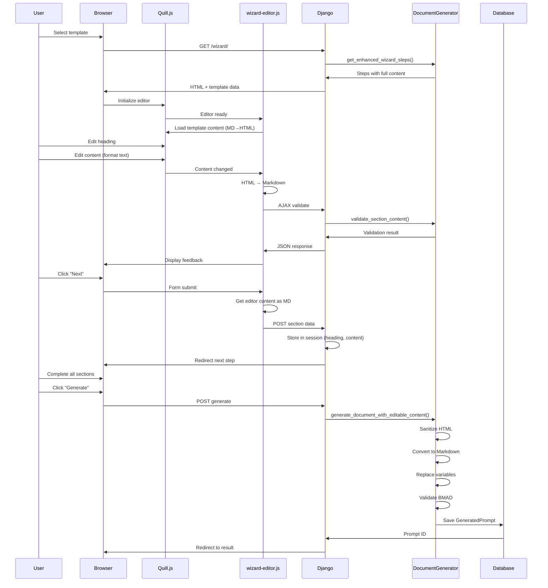

# BMAD Forge - System Architecture Documentation

**Version:** 1.2.0  
**Last Updated:** February 2, 2026  
**Status:** Production Ready

---

## Table of Contents

1. [System Overview](#system-overview)
2. [Architecture Principles](#architecture-principles)
3. [Component Architecture](#component-architecture)
4. [Data Flow](#data-flow)
5. [Security Architecture](#security-architecture)
6. [Database Schema](#database-schema)
7. [API Architecture](#api-architecture)
8. [Frontend Architecture](#frontend-architecture)
9. [Deployment Architecture](#deployment-architecture)
10. [Integration Points](#integration-points)

---

## 1. System Overview

### Purpose

BMAD Forge is a web-based platform for generating BMAD (Best Methodology for AI Development) Framework-compliant AI prompts. It provides:

- Template-based prompt generation
- **NEW:** Step-by-step wizard with inline editing
- **NEW:** Rich text editing with Markdown output
- Real-time validation
- BMAD compliance checking

### Technology Stack

**Backend:**
- Django 5.x (Python 3.11+)
- PostgreSQL (production) / SQLite (development)
- Django ORM for database abstraction
- Django Sessions for state management

**Frontend:**
- Bootstrap 5 (responsive UI framework)
- **NEW:** Quill.js 1.3.7 (rich text editor)
- Vanilla JavaScript (no framework overhead)
- AJAX for real-time validation

**Security:**
- Django CSRF middleware
- **NEW:** Multi-layer XSS prevention
- Input sanitization and validation
- Session security (HttpOnly, Secure flags)

**Infrastructure:**
- Web server: Gunicorn/uWSGI
- Reverse proxy: Nginx
- Static files: WhiteNoise/Nginx
- CDN: Cloudflare (optional)

---

## 2. Architecture Principles

### Core Principles

1. **Security by Design**
   - Security considered at every layer
   - Defense in depth (multiple security layers)
   - Fail securely (default to safe behavior)

2. **Separation of Concerns**
   - Models: Data structure and business logic
   - Views: Request handling and orchestration
   - Services: Complex business operations
   - Templates: Presentation layer

3. **Scalability**
   - Stateless application design
   - Session data stored centrally
   - Horizontal scaling ready
   - CDN for static assets

4. **Maintainability**
   - DRY (Don't Repeat Yourself)
   - Clear naming conventions
   - Comprehensive documentation
   - Modular design

5. **User Experience First**
   - Responsive design
   - Progressive enhancement
   - Real-time feedback
   - Accessibility (WCAG 2.1)

---

## 3. Component Architecture

### High-Level Architecture

```
┌─────────────────────────────────────────────────────┐
│                    User Interface                    │
│  ┌──────────────┐  ┌──────────────┐  ┌───────────┐ │
│  │   Dashboard  │  │    Wizard    │  │  Results  │ │
│  │   Template   │  │   Rich Text  │  │   Export  │ │
│  │   Selection  │  │   Editor     │  │   Share   │ │
│  └──────────────┘  └──────────────┘  └───────────┘ │
└─────────────────────────────────────────────────────┘
                         │
                         ▼
┌─────────────────────────────────────────────────────┐
│                 Django Application                   │
│  ┌──────────────┐  ┌──────────────┐  ┌───────────┐ │
│  │    Views     │  │   Services   │  │   Models  │ │
│  │  - Wizard    │  │  - DocGen    │  │  - Tmpl   │ │
│  │  - Results   │  │  - Validator │  │  - Prompt │ │
│  │  - API       │  │  - Parser    │  │  - User   │ │
│  └──────────────┘  └──────────────┘  └───────────┘ │
└─────────────────────────────────────────────────────┘
                         │
                         ▼
┌─────────────────────────────────────────────────────┐
│                   Data Layer                         │
│  ┌──────────────┐  ┌──────────────┐  ┌───────────┐ │
│  │  PostgreSQL  │  │   Sessions   │  │   Static  │ │
│  │   Database   │  │     Cache    │  │   Files   │ │
│  └──────────────┘  └──────────────┘  └───────────┘ │
└─────────────────────────────────────────────────────┘
```

### Component Breakdown

#### 3.1 Models Layer

**Purpose:** Data structure and business logic

**Components:**
- `Template` - Prompt templates
- `GeneratedPrompt` - User-generated prompts
- `User` - Django authentication
- `Session` - State management

**Responsibilities:**
- Define database schema
- Basic validation rules
- Business logic constraints
- Relationships and queries

#### 3.2 Services Layer

**Purpose:** Complex business operations

**Components:**
- `DocumentGenerator` - **ENHANCED** for inline editing
  - `generate_document_with_editable_content()` - NEW
  - `_html_to_markdown()` - NEW
  - `_sanitize_html_content()` - NEW
  - `extract_sections()`
  - `validate_section_content()`
  - `get_enhanced_wizard_steps()` - UPDATED

- `TemplateParser`
  - `parse_frontmatter()`
  - `extract_metadata()`
  - `get_section_guidance()`

- `BMADValidator`
  - `validate()`
  - `check_compliance()`

**Responsibilities:**
- Document generation
- Content sanitization
- Validation logic
- Template parsing

#### 3.3 Views Layer

**Purpose:** HTTP request handling

**Components:**
- `GenerateDocumentWizardView` - **ENHANCED**
  - Handles step-by-step editing
  - Session management
  - Form processing
  - Navigation control

- `PromptResultView`
  - Display generated prompts
  - Export functionality
  - Sharing options

- `TemplateListView`
  - Browse templates
  - Search and filter
  - Template selection

**Responsibilities:**
- Request/response handling
- Session management
- Authentication/authorization
- Template rendering

#### 3.4 Frontend Layer

**Purpose:** User interface and interaction

**Components:**
- **Quill.js Editor** - NEW
  - Rich text editing
  - Formatting toolbar
  - Dark theme integration

- **wizard-editor.js** - NEW
  - Editor initialization
  - HTML↔Markdown conversion
  - Real-time validation
  - State management

- **Bootstrap 5**
  - Responsive layout
  - UI components
  - Accessibility

**Responsibilities:**
- User interaction
- Real-time feedback
- Client-side validation
- AJAX communication

---

## 4. Data Flow

### 4.1 Document Generation Flow (Updated)



### 4.2 Session Data Flow

```
User Input → Quill Editor (HTML) → JS Converter → Markdown
    ↓
POST Request → Django View → Session Storage
    ↓
{
  'Section Name': {
    'heading': 'Custom Heading',
    'content': 'Markdown content...'
  }
}
    ↓
Generate → Document Generator → Final Document (Markdown)
    ↓
Database → GeneratedPrompt record
```

### 4.3 Security Data Flow

```
User Input
    ↓
Layer 1: Quill.js (safe tags only)
    ↓
Layer 2: JavaScript (HTML→MD conversion)
    ↓
Layer 3: Django View (CSRF check)
    ↓
Layer 4: Service (_sanitize_html_content)
    ↓
Layer 5: Database (ORM parameterization)
    ↓
Safe Storage
```

---

## 5. Security Architecture

### 5.1 Security Layers

**Layer 1: Client-Side (Browser)**
- Quill.js built-in sanitization
- Safe HTML tag whitelist
- CSRF token in forms
- XSS prevention in JavaScript

**Layer 2: Transport (HTTPS)**
- TLS 1.2+ encryption
- HSTS headers
- Secure cookies (production)

**Layer 3: Application (Django)**
- CSRF middleware
- Authentication/authorization
- Session security
- Input validation

**Layer 4: Service Layer**
- HTML sanitization
- Markdown conversion
- Variable validation
- Content checking

**Layer 5: Data Layer**
- ORM parameterization
- Database user permissions
- Encrypted connections
- Backup encryption

### 5.2 XSS Prevention Architecture

```
User Input: <script>alert('XSS')</script><p>Safe text</p>
    ↓
Quill.js Filter: [blocks script tags]
    ↓
HTML: <p>Safe text</p>
    ↓
HTML→Markdown Conversion: Safe text
    ↓
Server Sanitization: Safe text (double-check)
    ↓
Final Output: Safe text
```

### 5.3 Authentication & Authorization

**Authentication:**
- Django authentication system
- Session-based (cookies)
- Password hashing (PBKDF2)
- Optional: OAuth, SSO

**Authorization:**
- User owns their prompts
- Templates: public or user-specific
- Role-based access (future)

**Session Security:**
```python
SESSION_COOKIE_HTTPONLY = True   # No JS access
SESSION_COOKIE_SECURE = True     # HTTPS only (prod)
SESSION_COOKIE_SAMESITE = 'Lax'  # CSRF protection
SESSION_COOKIE_AGE = 7200        # 2 hours
```

---

## 6. Database Schema

### 6.1 Core Models

#### Template Model

```python
class Template(models.Model):
    id = AutoField(primary_key=True)
    title = CharField(max_length=200)
    content = TextField()  # Markdown with frontmatter
    agent_role = CharField(max_length=50)
    workflow_phase = CharField(max_length=50)
    is_active = BooleanField(default=True)
    created_at = DateTimeField(auto_now_add=True)
    updated_at = DateTimeField(auto_now=True)
```

#### GeneratedPrompt Model (Updated)

```python
class GeneratedPrompt(models.Model):
    id = AutoField(primary_key=True)
    template = ForeignKey(Template)
    user = ForeignKey(User)  # Optional
    
    # NEW: Structured input data
    input_data = JSONField()  # {sections: {...}, variables: {...}}
    
    final_output = TextField()  # Generated Markdown
    is_valid = BooleanField()
    validation_notes = JSONField()
    missing_variables = JSONField()
    
    created_at = DateTimeField(auto_now_add=True)
    updated_at = DateTimeField(auto_now=True)
```

#### Session Data Structure (Not in DB)

```python
# Stored in Django session (server-side)
session[f'doc_gen_{template_id}'] = {
    'Section Name 1': {
        'heading': 'Custom Heading',  # NEW
        'content': 'Markdown content'
    },
    'Section Name 2': {
        'heading': 'Another Heading',
        'content': 'More content'
    },
    'var_VARIABLE_NAME': 'value',
    'var_ANOTHER_VAR': 'value'
}
```

### 6.2 Entity Relationship Diagram

```
┌─────────────┐         ┌──────────────────┐
│   User      │         │    Template      │
│─────────────│         │──────────────────│
│ id (PK)     │         │ id (PK)          │
│ username    │         │ title            │
│ email       │         │ content          │
│ password    │         │ agent_role       │
│ is_active   │         │ workflow_phase   │
└─────────────┘         │ is_active        │
       │                │ created_at       │
       │                │ updated_at       │
       │                └──────────────────┘
       │                       │
       │                       │
       │   ┌───────────────────┘
       │   │
       ▼   ▼
┌──────────────────┐
│ GeneratedPrompt  │
│──────────────────│
│ id (PK)          │
│ user_id (FK)     │
│ template_id (FK) │
│ input_data (JSON)│ ← NEW: Structured edits
│ final_output     │
│ is_valid         │
│ validation_notes │
│ created_at       │
└──────────────────┘
```

---

## 7. API Architecture

### 7.1 RESTful Endpoints

**Template Management:**
```
GET  /forge/templates/           - List all templates
GET  /forge/template/{id}/       - Template detail
```

**Wizard Flow:**
```
GET  /forge/template/{id}/wizard/?step={n}  - Wizard step
POST /forge/template/{id}/wizard/           - Submit step data
```

**Validation (AJAX):**
```
POST /forge/template/{id}/validate-section/  - Real-time validation
POST /forge/template/{id}/validate-variable/ - Variable validation
```

**Results:**
```
GET  /forge/prompt/result/{id}/  - View generated prompt
GET  /forge/prompt/{id}/export/  - Export prompt
```

### 7.2 AJAX API Responses

**Validation Response:**
```json
{
  "is_valid": true,
  "section_name": "Your Role",
  "errors": [],
  "warnings": ["Consider adding more detail"],
  "suggestions": ["Specify output format"],
  "info": [],
  "word_count": 45,
  "min_words": 10,
  "completion_percentage": 95
}
```

**Error Response:**
```json
{
  "error": "Validation failed",
  "details": {
    "section": "Input",
    "issues": ["Missing required keywords"]
  }
}
```

---

## 8. Frontend Architecture

### 8.1 JavaScript Architecture (Updated)

**Module Structure:**
```
wizard-editor.js
├── Editor Management
│   ├── initializeEditor()
│   ├── loadTemplateContent()
│   └── getEditorContentAsMarkdown()
│
├── Conversion Layer
│   ├── markdownToHtml()
│   ├── htmlToMarkdown()
│   └── _process_list()
│
├── Validation
│   ├── triggerRealtimeValidation()
│   ├── performRealtimeValidation()
│   └── displayValidationResults()
│
├── State Management
│   ├── resetToTemplate()
│   ├── isContentModified()
│   └── updateModifiedIndicator()
│
└── Utilities
    ├── getCsrfToken()
    ├── escapeHtml()
    └── showNotification()
```

### 8.2 Component Communication

```
User Action
    ↓
Quill Editor (emits events)
    ↓
Event Handlers (wizard-editor.js)
    ↓
State Update (session storage)
    ↓
AJAX Request (optional - validation)
    ↓
Django Backend
    ↓
JSON Response
    ↓
UI Update (display feedback)
```

### 8.3 CSS Architecture

**Structure:**
```
Bootstrap 5 (base framework)
    ├── Grid system
    ├── Components
    └── Utilities

Custom CSS
    ├── wizard.css
    │   ├── Progress indicators
    │   ├── Step navigation
    │   └── Validation feedback
    │
    └── editor.css (NEW)
        ├── Quill dark theme
        ├── Editor container
        └── Toolbar styling
```

---

## 9. Deployment Architecture

### 9.1 Development Environment

```
Developer Workstation
    ↓
Django Dev Server (runserver)
    ↓
SQLite Database
    ↓
Local Static Files
```

### 9.2 Production Environment

```
                    Internet
                        ↓
                [Load Balancer]
                        ↓
        ┌───────────────┴───────────────┐
        ▼                               ▼
    [Nginx 1]                       [Nginx 2]
    (Reverse Proxy)                 (Reverse Proxy)
    Static Files                    Static Files
        ↓                               ↓
    [Gunicorn 1]                    [Gunicorn 2]
    Django App                      Django App
        ↓                               ↓
        └───────────────┬───────────────┘
                        ↓
                [PostgreSQL]
                (Master/Replica)
                        ↓
                [Backup Storage]
```

### 9.3 Scaling Strategy

**Horizontal Scaling:**
- Stateless application servers
- Session storage in database/Redis
- CDN for static files
- Load balancer distribution

**Vertical Scaling:**
- Database optimization
- Query optimization
- Caching layer
- Connection pooling

---

## 10. Integration Points

### 10.1 External Services

**CDN (Quill.js):**
```
https://cdn.quilljs.com/1.3.7/
├── quill.min.js
└── quill.snow.css
```

**Future Integrations:**
- GitHub API (template sync)
- Export services (PDF, DOCX)
- Analytics (usage tracking)
- Monitoring (Sentry, New Relic)

### 10.2 Internal Integration

**Services Communication:**
```python
# View → Service
from forge.services.document_generator import DocumentGenerator

def view_method(self):
    result, validations = DocumentGenerator.generate_document_with_editable_content(
        template_content,
        edited_sections,
        variable_data
    )
```

**Model → Service:**
```python
# Service → Model
from forge.models import Template, GeneratedPrompt

template = Template.objects.get(id=template_id)
prompt = GeneratedPrompt.objects.create(...)
```

---

## Appendix A: File Structure

```
bmad_forge/
├── webapp/
│   ├── manage.py
│   ├── config/
│   │   ├── settings.py
│   │   ├── urls.py
│   │   └── wsgi.py
│   │
│   └── forge/
│       ├── models.py
│       ├── views.py
│       ├── urls.py
│       ├── admin.py
│       │
│       ├── services/
│       │   ├── document_generator.py  ← ENHANCED
│       │   ├── template_parser.py
│       │   └── bmad_validator.py
│       │
│       ├── templates/
│       │   └── forge/
│       │       ├── base.html
│       │       ├── dashboard.html
│       │       ├── generate_document_wizard.html  ← ENHANCED
│       │       └── prompt_result.html
│       │
│       ├── static/
│       │   └── forge/
│       │       ├── css/
│       │       │   ├── style.css
│       │       │   └── wizard.css
│       │       └── js/
│       │           └── wizard-editor.js  ← NEW
│       │
│       └── tests/
│           ├── test_document_generator_editing.py  ← NEW
│           └── test_wizard_view_editing.py  ← NEW
│
├── docs/
│   ├── ARCHITECTURE.md  ← This file
│   ├── API_GUIDE.md
│   ├── USER_GUIDE.md
│   └── DEPLOYMENT.md
│
└── requirements.txt
```

---

## Appendix B: Configuration Examples

### Django Settings (Production)

```python
# Security
DEBUG = False
ALLOWED_HOSTS = ['bmad-forge.example.com']
SECRET_KEY = env('SECRET_KEY')  # From environment

# Database
DATABASES = {
    'default': {
        'ENGINE': 'django.db.backends.postgresql',
        'NAME': 'bmad_forge',
        'USER': 'bmad_user',
        'PASSWORD': env('DB_PASSWORD'),
        'HOST': 'db.internal',
        'PORT': '5432',
    }
}

# Security Headers
SECURE_SSL_REDIRECT = True
SESSION_COOKIE_SECURE = True
CSRF_COOKIE_SECURE = True
SECURE_HSTS_SECONDS = 31536000

# Session Configuration
SESSION_ENGINE = 'django.contrib.sessions.backends.cached_db'
SESSION_COOKIE_HTTPONLY = True
SESSION_COOKIE_AGE = 7200  # 2 hours

# Static Files
STATIC_ROOT = '/var/www/bmad-forge/static/'
STATIC_URL = '/static/'
STATICFILES_STORAGE = 'whitenoise.storage.CompressedManifestStaticFilesStorage'
```

---

## Appendix C: Performance Considerations

### Database Optimization

**Indexes:**
```python
class GeneratedPrompt(models.Model):
    # ... fields ...
    
    class Meta:
        indexes = [
            models.Index(fields=['user', 'created_at']),
            models.Index(fields=['template', 'created_at']),
        ]
```

**Query Optimization:**
```python
# Use select_related for foreign keys
prompts = GeneratedPrompt.objects.select_related('template', 'user')

# Use prefetch_related for many-to-many
templates = Template.objects.prefetch_related('generated_prompts')
```

### Caching Strategy

```python
# Cache template list (rarely changes)
from django.core.cache import cache

def get_active_templates():
    templates = cache.get('active_templates')
    if templates is None:
        templates = Template.objects.filter(is_active=True)
        cache.set('active_templates', templates, 3600)  # 1 hour
    return templates
```

---

## Appendix D: Monitoring & Logging

### Application Logging

```python
import logging

logger = logging.getLogger('forge')

# In service
logger.info(f"Generating document for template {template_id}")
logger.warning(f"Validation warning: {validation.warnings}")
logger.error(f"Document generation failed: {str(e)}")
```

### Metrics to Monitor

1. **Performance:**
   - Page load times
   - AJAX response times
   - Document generation duration

2. **Usage:**
   - Active users
   - Documents generated
   - Templates most used

3. **Errors:**
   - 500 errors (application)
   - 400 errors (client)
   - Validation failures

4. **Security:**
   - Failed login attempts
   - CSRF token failures
   - XSS attempt detections

---

**Version History:**

| Version | Date | Changes |
|---------|------|---------|
| 1.0.0 | 2025-01-15 | Initial architecture |
| 1.1.0 | 2025-01-30 | Added wizard flow |
| 1.2.0 | 2026-02-02 | Inline editing, rich text, enhanced security |

**Document Owner:** Development Team  
**Review Cycle:** Quarterly  
**Next Review:** May 2026
