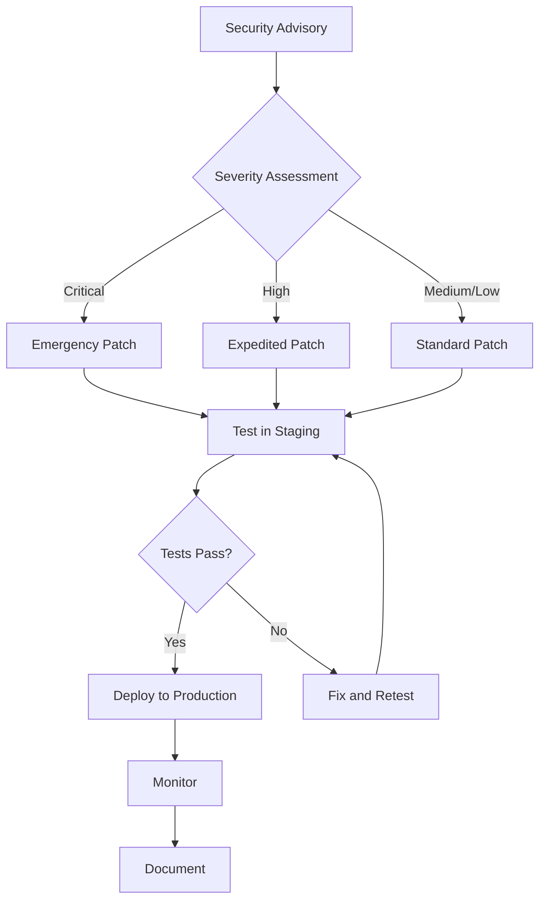
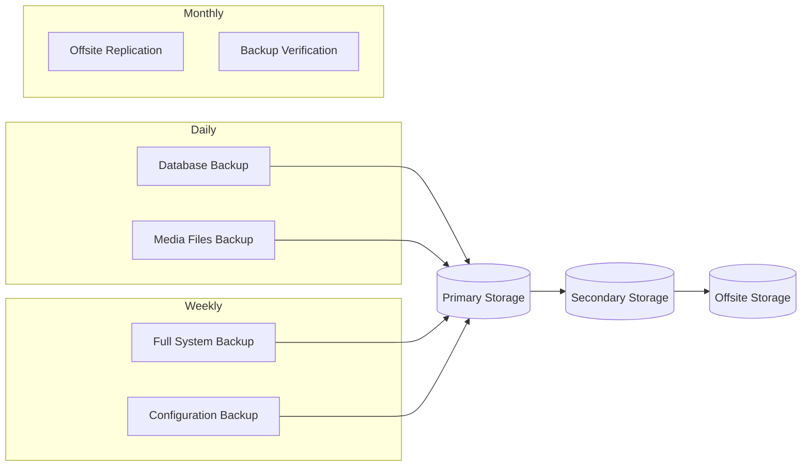

# BMAD Forge Maintenance Guide

## Overview

This guide provides procedures for maintaining BMAD Forge in production environments. It covers routine maintenance tasks, patching procedures, backup strategies, and health monitoring.

## Table of Contents

1. [Patching Procedures](#patching-procedures)
2. [Backup and Restore](#backup-and-restore)
3. [Log Management](#log-management)
4. [Health Monitoring](#health-monitoring)
5. [Database Maintenance](#database-maintenance)
6. [Cache Management](#cache-management)
7. [Certificate Management](#certificate-management)
8. [Scheduled Tasks](#scheduled-tasks)

---

## Patching Procedures

### Security Patch Workflow



### Patch Timeline

| Severity | Response Time | Deployment Window |
|----------|---------------|-------------------|
| Critical | 4 hours | Immediate |
| High | 24 hours | Next business day |
| Medium | 7 days | Weekly maintenance |
| Low | 30 days | Monthly maintenance |

### Dependency Update Procedure

1. **Review Updates**
   ```bash
   # Check for outdated packages
   pip list --outdated

   # Check for security vulnerabilities
   safety check --file requirements.txt
   pip-audit
   ```

2. **Update Dependencies**
   ```bash
   # Update specific package
   pip install --upgrade django==5.2.11

   # Update requirements file
   pip freeze > requirements.txt.new
   diff requirements.txt requirements.txt.new
   ```

3. **Test Changes**
   ```bash
   # Run test suite
   pytest --cov=forge

   # Run security checks
   bandit -r webapp/forge/
   python manage.py check --deploy
   ```

4. **Deploy**
   ```bash
   # Deploy to staging
   ./deploy.sh staging

   # Verify functionality
   ./smoke-tests.sh staging

   # Deploy to production
   ./deploy.sh production
   ```

### Django Security Updates

```bash
# Check Django version
python -c "import django; print(django.VERSION)"

# Update Django
pip install --upgrade Django

# Run migrations if needed
python manage.py migrate

# Verify security settings
python manage.py check --deploy
```

---

## Backup and Restore

### Backup Strategy



### Database Backup

**Automated Daily Backup Script:**

```bash
#!/bin/bash
# /opt/bmad-forge/scripts/backup-database.sh

set -euo pipefail

BACKUP_DIR="/var/backups/bmad-forge/database"
TIMESTAMP=$(date +%Y%m%d_%H%M%S)
DB_NAME="${DB_NAME:-bmad_forge}"
RETENTION_DAYS=30

# Create backup
echo "Starting database backup..."
pg_dump -U bmad_forge_backup -h localhost "$DB_NAME" | gzip > "$BACKUP_DIR/bmad_forge_$TIMESTAMP.sql.gz"

# Verify backup
if gunzip -t "$BACKUP_DIR/bmad_forge_$TIMESTAMP.sql.gz"; then
    echo "Backup verified successfully"
else
    echo "ERROR: Backup verification failed"
    exit 1
fi

# Encrypt backup (optional)
if [ -n "${GPG_RECIPIENT:-}" ]; then
    gpg --encrypt --recipient "$GPG_RECIPIENT" "$BACKUP_DIR/bmad_forge_$TIMESTAMP.sql.gz"
    rm "$BACKUP_DIR/bmad_forge_$TIMESTAMP.sql.gz"
fi

# Clean old backups
find "$BACKUP_DIR" -name "*.sql.gz*" -mtime +$RETENTION_DAYS -delete

echo "Backup completed: bmad_forge_$TIMESTAMP.sql.gz"
```

### Database Restore

```bash
#!/bin/bash
# /opt/bmad-forge/scripts/restore-database.sh

set -euo pipefail

BACKUP_FILE="$1"
DB_NAME="${DB_NAME:-bmad_forge}"

if [ -z "$BACKUP_FILE" ]; then
    echo "Usage: $0 <backup_file>"
    exit 1
fi

echo "WARNING: This will overwrite the existing database!"
read -p "Continue? (yes/no): " confirm
if [ "$confirm" != "yes" ]; then
    echo "Aborted"
    exit 0
fi

# Stop application
systemctl stop bmad-forge

# Decrypt if encrypted
if [[ "$BACKUP_FILE" == *.gpg ]]; then
    gpg --decrypt "$BACKUP_FILE" > "${BACKUP_FILE%.gpg}"
    BACKUP_FILE="${BACKUP_FILE%.gpg}"
fi

# Restore database
echo "Restoring database..."
dropdb -U postgres "$DB_NAME" --if-exists
createdb -U postgres "$DB_NAME"
gunzip -c "$BACKUP_FILE" | psql -U postgres "$DB_NAME"

# Restart application
systemctl start bmad-forge

echo "Database restored successfully"
```

### Media Files Backup

```bash
#!/bin/bash
# Backup uploaded files and static assets

BACKUP_DIR="/var/backups/bmad-forge/media"
TIMESTAMP=$(date +%Y%m%d_%H%M%S)
SOURCE_DIR="/var/www/bmad-forge/media"

# Create incremental backup
rsync -av --link-dest="$BACKUP_DIR/latest" \
    "$SOURCE_DIR/" \
    "$BACKUP_DIR/$TIMESTAMP/"

# Update latest symlink
rm -f "$BACKUP_DIR/latest"
ln -s "$BACKUP_DIR/$TIMESTAMP" "$BACKUP_DIR/latest"
```

---

## Log Management

### Log Locations

| Log Type | Location | Rotation |
|----------|----------|----------|
| Application | /var/log/bmad-forge/app.log | Daily, 10 files |
| Security | /var/log/bmad-forge/security.log | Daily, 30 files |
| Access | /var/log/nginx/bmad-forge.access.log | Daily, 14 files |
| Error | /var/log/nginx/bmad-forge.error.log | Daily, 14 files |
| Database | /var/log/postgresql/postgresql-*.log | Weekly, 4 files |

### Log Rotation Configuration

```conf
# /etc/logrotate.d/bmad-forge
/var/log/bmad-forge/*.log {
    daily
    missingok
    rotate 10
    compress
    delaycompress
    notifempty
    create 0640 bmad-forge bmad-forge
    sharedscripts
    postrotate
        systemctl reload bmad-forge >/dev/null 2>&1 || true
    endscript
}
```

### Log Analysis

```bash
# View recent errors
tail -f /var/log/bmad-forge/app.log | grep -i error

# Count errors by type
grep -oP 'ERROR.*?:' /var/log/bmad-forge/app.log | sort | uniq -c | sort -rn

# Search for specific patterns
grep "Template.DoesNotExist" /var/log/bmad-forge/app.log

# View security events
tail -100 /var/log/bmad-forge/security.log
```

### Log Aggregation

For production environments, configure log shipping to a central logging system:

```python
# settings/production.py - Syslog configuration
LOGGING = {
    'version': 1,
    'handlers': {
        'syslog': {
            'level': 'INFO',
            'class': 'logging.handlers.SysLogHandler',
            'facility': 'local0',
            'address': '/dev/log',
        },
    },
    'loggers': {
        'forge': {
            'handlers': ['syslog'],
            'level': 'INFO',
        },
    },
}
```

---

## Health Monitoring

### Health Check Endpoint

```bash
# Check application health
curl -s http://localhost:8000/health/ | jq .

# Expected response:
{
  "status": "healthy",
  "app": "BMAD Forge",
  "version": "1.3.0",
  "checks": {
    "database": "ok",
    "cache": "ok"
  }
}
```

### Monitoring Metrics

| Metric | Warning | Critical | Action |
|--------|---------|----------|--------|
| Response Time (p95) | > 500ms | > 2000ms | Scale horizontally |
| Error Rate | > 1% | > 5% | Investigate logs |
| CPU Usage | > 70% | > 90% | Scale vertically |
| Memory Usage | > 80% | > 95% | Restart/Scale |
| Disk Usage | > 70% | > 90% | Cleanup/Expand |
| Database Connections | > 80% | > 95% | Tune pool size |

### Monitoring Script

```bash
#!/bin/bash
# /opt/bmad-forge/scripts/health-check.sh

HEALTH_URL="http://localhost:8000/health/"
ALERT_EMAIL="ops@example.com"

response=$(curl -s -w "\n%{http_code}" "$HEALTH_URL")
http_code=$(echo "$response" | tail -n1)
body=$(echo "$response" | sed '$d')

if [ "$http_code" != "200" ]; then
    echo "CRITICAL: Health check failed with HTTP $http_code"
    echo "$body" | mail -s "BMAD Forge Health Check Failed" "$ALERT_EMAIL"
    exit 2
fi

status=$(echo "$body" | jq -r '.status')
if [ "$status" != "healthy" ]; then
    echo "WARNING: Application unhealthy"
    echo "$body" | mail -s "BMAD Forge Unhealthy" "$ALERT_EMAIL"
    exit 1
fi

echo "OK: Application healthy"
exit 0
```

### Prometheus Metrics

```python
# Optional: Add prometheus_client for metrics export
from prometheus_client import Counter, Histogram, generate_latest

REQUEST_COUNT = Counter(
    'bmad_forge_requests_total',
    'Total HTTP requests',
    ['method', 'endpoint', 'status']
)

REQUEST_LATENCY = Histogram(
    'bmad_forge_request_latency_seconds',
    'HTTP request latency',
    ['method', 'endpoint']
)
```

---

## Database Maintenance

### Routine Maintenance Tasks

```bash
# Analyze tables for query optimization
psql -U bmad_forge -d bmad_forge -c "ANALYZE;"

# Vacuum to reclaim space
psql -U bmad_forge -d bmad_forge -c "VACUUM ANALYZE;"

# Full vacuum (requires exclusive lock)
psql -U bmad_forge -d bmad_forge -c "VACUUM FULL;"

# Reindex to optimize indexes
psql -U bmad_forge -d bmad_forge -c "REINDEX DATABASE bmad_forge;"
```

### Index Health Check

```sql
-- Check for unused indexes
SELECT
    schemaname || '.' || relname AS table,
    indexrelname AS index,
    pg_size_pretty(pg_relation_size(i.indexrelid)) AS size,
    idx_scan AS scans
FROM pg_stat_user_indexes i
JOIN pg_index USING (indexrelid)
WHERE idx_scan < 50
ORDER BY pg_relation_size(i.indexrelid) DESC;

-- Check for missing indexes (slow queries)
SELECT
    query,
    calls,
    total_time / 1000 AS total_seconds,
    mean_time AS avg_ms
FROM pg_stat_statements
ORDER BY total_time DESC
LIMIT 10;
```

### Database Connection Pool

```python
# settings/production.py
DATABASES = {
    'default': {
        # ... connection settings ...
        'CONN_MAX_AGE': 600,  # 10 minutes
        'CONN_HEALTH_CHECKS': True,
        'OPTIONS': {
            'connect_timeout': 10,
            'options': '-c statement_timeout=30000',  # 30 seconds
        },
    }
}
```

---

## Cache Management

### Redis Cache Maintenance

```bash
# Check cache statistics
redis-cli INFO stats

# Monitor cache operations in real-time
redis-cli MONITOR

# Check memory usage
redis-cli INFO memory

# Clear all cache (careful!)
redis-cli FLUSHDB

# Clear specific cache keys
redis-cli KEYS "bmad:*" | xargs redis-cli DEL
```

### Cache Warming

```python
# management/commands/warm_cache.py
from django.core.management.base import BaseCommand
from django.core.cache import cache
from forge.models import Template

class Command(BaseCommand):
    help = 'Warm up the cache with commonly accessed data'

    def handle(self, *args, **options):
        # Cache all active templates
        templates = Template.objects.filter(is_active=True)
        for template in templates:
            cache_key = f'template:{template.id}'
            cache.set(cache_key, template, timeout=3600)
            self.stdout.write(f'Cached template: {template.title}')

        self.stdout.write(self.style.SUCCESS('Cache warmed successfully'))
```

---

## Certificate Management

### Certificate Renewal

```bash
#!/bin/bash
# /opt/bmad-forge/scripts/renew-certs.sh

# Renew Let's Encrypt certificates
certbot renew --quiet --post-hook "systemctl reload nginx"

# Verify certificate
openssl x509 -in /etc/letsencrypt/live/example.com/cert.pem -noout -dates
```

### Certificate Monitoring

```bash
#!/bin/bash
# Check certificate expiration

DOMAIN="example.com"
WARN_DAYS=30

expiry=$(echo | openssl s_client -servername "$DOMAIN" -connect "$DOMAIN:443" 2>/dev/null | \
    openssl x509 -noout -enddate | cut -d= -f2)

expiry_epoch=$(date -d "$expiry" +%s)
now_epoch=$(date +%s)
days_left=$(( (expiry_epoch - now_epoch) / 86400 ))

if [ $days_left -lt $WARN_DAYS ]; then
    echo "WARNING: Certificate expires in $days_left days"
    exit 1
fi

echo "OK: Certificate valid for $days_left days"
```

---

## Scheduled Tasks

### Cron Configuration

```cron
# /etc/cron.d/bmad-forge

# Database backup - daily at 2:00 AM
0 2 * * * bmad-forge /opt/bmad-forge/scripts/backup-database.sh >> /var/log/bmad-forge/backup.log 2>&1

# Media backup - daily at 3:00 AM
0 3 * * * bmad-forge /opt/bmad-forge/scripts/backup-media.sh >> /var/log/bmad-forge/backup.log 2>&1

# Log cleanup - weekly on Sunday at 4:00 AM
0 4 * * 0 bmad-forge /opt/bmad-forge/scripts/cleanup-logs.sh >> /var/log/bmad-forge/maintenance.log 2>&1

# Database maintenance - weekly on Sunday at 5:00 AM
0 5 * * 0 bmad-forge /opt/bmad-forge/scripts/db-maintenance.sh >> /var/log/bmad-forge/maintenance.log 2>&1

# Health check - every 5 minutes
*/5 * * * * bmad-forge /opt/bmad-forge/scripts/health-check.sh >> /var/log/bmad-forge/health.log 2>&1

# Template sync - daily at 6:00 AM
0 6 * * * bmad-forge cd /var/www/bmad-forge && python manage.py sync_templates >> /var/log/bmad-forge/sync.log 2>&1
```

### Maintenance Window

| Task | Schedule | Duration | Impact |
|------|----------|----------|--------|
| Database backup | Daily 2:00 AM | ~5 minutes | None |
| Full vacuum | Monthly, 1st Sunday | ~30 minutes | Degraded performance |
| System updates | Monthly, 2nd Saturday | 1-2 hours | Maintenance mode |
| Certificate renewal | Before expiry | ~1 minute | Brief nginx reload |

---

## Emergency Procedures

### Application Restart

```bash
# Graceful restart
systemctl restart bmad-forge

# Force restart (if graceful fails)
systemctl kill -s SIGKILL bmad-forge
systemctl start bmad-forge
```

### Rollback Procedure

```bash
# List available releases
ls -la /var/www/bmad-forge/releases/

# Rollback to previous release
cd /var/www/bmad-forge
rm current
ln -s releases/20260128_120000 current
systemctl restart bmad-forge
```

### Database Recovery

```bash
# Point-in-time recovery
pg_restore -U postgres -d bmad_forge_recovery --target-time="2026-01-28 12:00:00" /var/backups/bmad-forge/database/latest.sql.gz
```

---

## Contact Information

| Role | Contact | Availability |
|------|---------|--------------|
| On-Call Engineer | oncall@example.com | 24/7 |
| Database Admin | dba@example.com | Business hours |
| Security Team | security@example.com | 24/7 for incidents |

---

## Revision History

| Version | Date | Author | Changes |
|---------|------|--------|---------|
| 1.0 | 2026-01-29 | Operations Team | Initial document |
