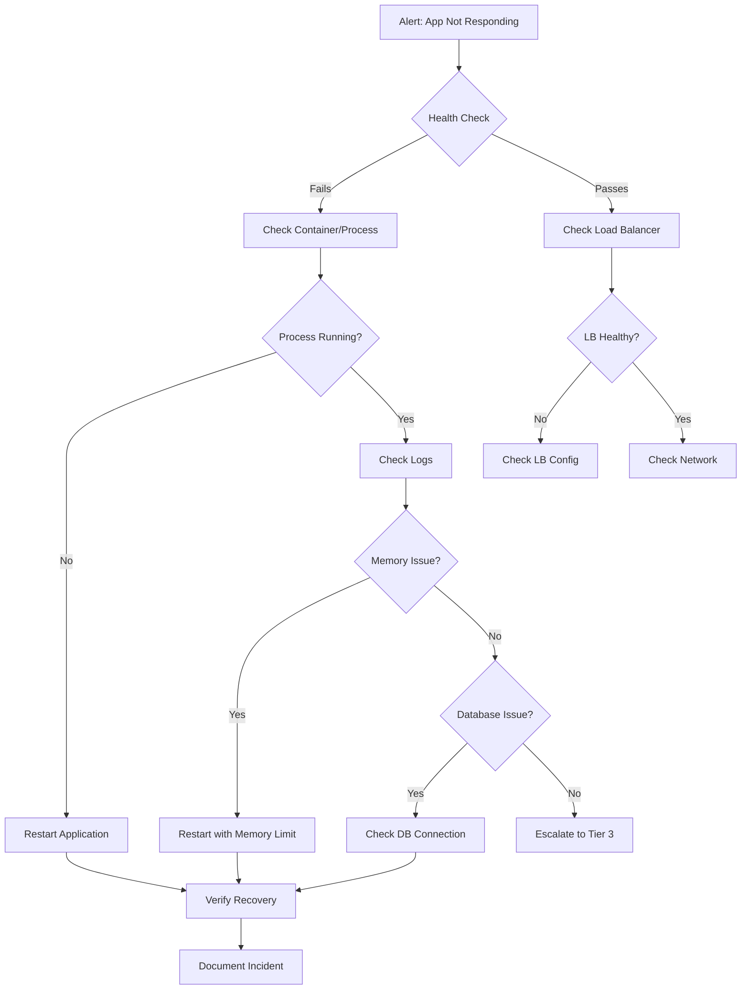
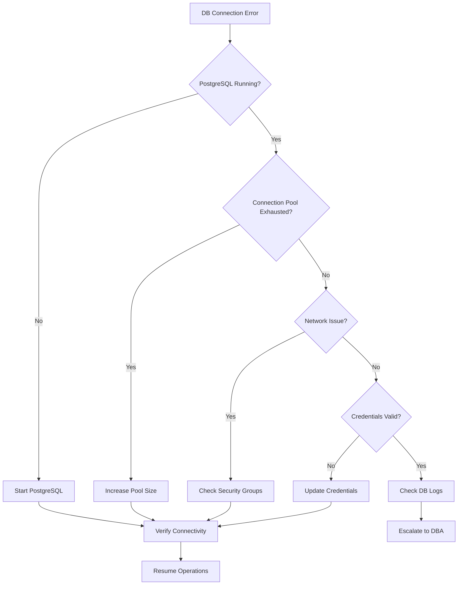

# BMAD Forge Support Tasks Guide

## Overview

This guide provides support procedures, common tasks, runbooks, and escalation procedures for BMAD Forge support teams.

## Table of Contents

1. [Support Tiers](#support-tiers)
2. [Common Support Tasks](#common-support-tasks)
3. [Runbooks](#runbooks)
4. [Troubleshooting Guide](#troubleshooting-guide)
5. [Escalation Matrix](#escalation-matrix)

---

## Support Tiers

### Tier 1 - Help Desk

**Responsibilities:**
- Initial ticket triage
- Basic troubleshooting
- Password resets
- Account access issues
- Documentation guidance

**Tools Access:**
- Admin dashboard (read-only)
- Ticketing system
- Knowledge base

### Tier 2 - Application Support

**Responsibilities:**
- Application configuration
- Template management
- Data validation issues
- Performance troubleshooting
- Log analysis

**Tools Access:**
- Admin dashboard (full access)
- Application logs
- Database (read-only)

### Tier 3 - Engineering Support

**Responsibilities:**
- Bug investigation and fixes
- Database operations
- Infrastructure issues
- Security incidents
- Production deployments

**Tools Access:**
- Full system access
- Production database
- Infrastructure management

---

## Common Support Tasks

### Task 1: Reset User Password

**Tier:** 1

```bash
# Access Django admin shell
python manage.py shell

# Reset password
from django.contrib.auth.models import User
user = User.objects.get(username='affected_user')
user.set_password('temporary_password')
user.save()

# Force password change on next login (if implemented)
user.profile.force_password_change = True
user.profile.save()
```

**Alternative via Admin Interface:**
1. Navigate to `/admin/auth/user/`
2. Find user by username or email
3. Click "Change password" link
4. Set new password
5. Notify user

---

### Task 2: Regenerate API Token

**Tier:** 1

```bash
python manage.py shell

from rest_framework.authtoken.models import Token
from django.contrib.auth.models import User

user = User.objects.get(username='user_name')
# Delete existing token
Token.objects.filter(user=user).delete()
# Create new token
token = Token.objects.create(user=user)
print(f"New token: {token.key}")
```

---

### Task 3: Clear User Session

**Tier:** 1

```bash
python manage.py shell

from django.contrib.sessions.models import Session
from django.contrib.auth.models import User

user = User.objects.get(username='affected_user')
# Clear all sessions for user
Session.objects.filter(session_key__in=[
    s.session_key for s in Session.objects.all()
    if s.get_decoded().get('_auth_user_id') == str(user.id)
]).delete()
```

---

### Task 4: View User Activity

**Tier:** 2

```sql
-- Recent prompts generated by user
SELECT
    gp.id,
    gp.created_at,
    t.title as template_title,
    gp.is_valid
FROM forge_generatedprompt gp
JOIN forge_template t ON gp.template_id = t.id
WHERE gp.created_by = 'username'
ORDER BY gp.created_at DESC
LIMIT 20;
```

---

### Task 5: Template Sync Issues

**Tier:** 2

**Check sync status:**
```bash
python manage.py shell

from forge.services import GitHubSyncService
service = GitHubSyncService()

# Check last sync
from forge.models import Template
latest = Template.objects.order_by('-synced_at').first()
print(f"Last sync: {latest.synced_at if latest else 'Never'}")

# Manual sync
results = service.sync_from_config()
print(results)
```

**Common Issues:**
| Issue | Cause | Solution |
|-------|-------|----------|
| 401 Unauthorized | Invalid GitHub token | Update GITHUB_TOKEN in environment |
| 403 Rate Limited | API rate limit exceeded | Wait or use authenticated requests |
| 404 Not Found | Repository path changed | Update config.yaml |
| Timeout | Large repository | Increase timeout, sync smaller batches |

---

### Task 6: Investigate Validation Failures

**Tier:** 2

```python
# Check validation results
from forge.models import GeneratedPrompt
from forge.services import BMADValidator

prompt = GeneratedPrompt.objects.get(id=123)
report = BMADValidator.validate(prompt.final_output)

print(f"Valid: {report.is_valid}")
print(f"Score: {report.score}")
print(f"Missing sections: {report.missing_sections}")
print(f"Unreplaced vars: {report.unreplaced_variables}")
for result in report.results:
    print(f"- {result.severity}: {result.message}")
```

---

### Task 7: Database Query Performance

**Tier:** 3

```sql
-- Identify slow queries
SELECT
    query,
    calls,
    total_time / 1000 as total_seconds,
    mean_time as avg_ms,
    rows
FROM pg_stat_statements
ORDER BY total_time DESC
LIMIT 10;

-- Check table sizes
SELECT
    relname as table_name,
    pg_size_pretty(pg_total_relation_size(relid)) as total_size,
    pg_size_pretty(pg_relation_size(relid)) as data_size,
    n_live_tup as row_count
FROM pg_stat_user_tables
ORDER BY pg_total_relation_size(relid) DESC;

-- Check index usage
SELECT
    indexrelname as index_name,
    idx_scan as scans,
    idx_tup_read as tuples_read,
    idx_tup_fetch as tuples_fetched
FROM pg_stat_user_indexes
ORDER BY idx_scan DESC;
```

---

## Runbooks

### Runbook 1: Application Not Responding



**Steps:**
1. **Check health endpoint**
   ```bash
   curl -v http://localhost:8000/health/
   ```

2. **Check application process**
   ```bash
   systemctl status bmad-forge
   journalctl -u bmad-forge -n 100
   ```

3. **Check for errors**
   ```bash
   tail -100 /var/log/bmad-forge/app.log | grep -i error
   ```

4. **Check resources**
   ```bash
   top -b -n 1 | head -20
   free -h
   df -h
   ```

5. **Restart if needed**
   ```bash
   systemctl restart bmad-forge
   ```

6. **Verify recovery**
   ```bash
   curl -s http://localhost:8000/health/ | jq .
   ```

---

### Runbook 2: High Error Rate

**Detection:** Error rate > 5% for 5 minutes

**Steps:**

1. **Identify error types**
   ```bash
   grep -c "ERROR" /var/log/bmad-forge/app.log
   grep "ERROR" /var/log/bmad-forge/app.log | tail -50
   ```

2. **Check error distribution**
   ```bash
   grep "ERROR" /var/log/bmad-forge/app.log | \
     awk '{print $6}' | sort | uniq -c | sort -rn | head -10
   ```

3. **Check for patterns**
   - Same user?
   - Same endpoint?
   - Same time?

4. **Common error resolutions**

   | Error | Resolution |
   |-------|------------|
   | Database connection | Check PostgreSQL, restart if needed |
   | Template not found | Trigger template sync |
   | Validation error | Check template format |
   | Memory error | Restart application |

5. **Escalate if unresolved**
   - Gather logs and metrics
   - Create incident ticket
   - Page on-call engineer

---

### Runbook 3: Database Connection Failure



**Steps:**

1. **Check PostgreSQL status**
   ```bash
   systemctl status postgresql
   pg_isready -h localhost -p 5432
   ```

2. **Check connection count**
   ```sql
   SELECT count(*) FROM pg_stat_activity;
   SELECT max_connections FROM pg_settings WHERE name = 'max_connections';
   ```

3. **Check for blocking queries**
   ```sql
   SELECT pid, now() - pg_stat_activity.query_start AS duration, query, state
   FROM pg_stat_activity
   WHERE state != 'idle'
   ORDER BY duration DESC
   LIMIT 10;
   ```

4. **Terminate long-running queries if needed**
   ```sql
   SELECT pg_terminate_backend(pid)
   FROM pg_stat_activity
   WHERE duration > interval '5 minutes'
   AND state != 'idle';
   ```

---

### Runbook 4: Template Sync Failure

**Steps:**

1. **Check GitHub API status**
   ```bash
   curl -s https://www.githubstatus.com/api/v2/status.json | jq .status
   ```

2. **Verify GitHub token**
   ```bash
   curl -H "Authorization: token $GITHUB_TOKEN" \
     https://api.github.com/rate_limit | jq .
   ```

3. **Check sync logs**
   ```bash
   tail -100 /var/log/bmad-forge/sync.log
   ```

4. **Manual sync attempt**
   ```bash
   python manage.py sync_templates --owner owner --repo repo --path path
   ```

5. **Verify templates**
   ```bash
   python manage.py shell -c "from forge.models import Template; print(Template.objects.count())"
   ```

---

## Troubleshooting Guide

### Error: "Template.DoesNotExist"

**Cause:** Requested template ID not in database or inactive

**Resolution:**
1. Check template exists: `Template.objects.filter(id=X).exists()`
2. Check template is active: `Template.objects.get(id=X).is_active`
3. Run template sync if missing

---

### Error: "CSRF token missing or incorrect"

**Cause:** CSRF validation failure

**Resolution:**
1. Ensure CSRF token in form: ``
2. Check cookie settings: `CSRF_COOKIE_SECURE`, `CSRF_COOKIE_SAMESITE`
3. Verify AJAX requests include CSRF header

---

### Error: "OperationalError: connection to server at... failed"

**Cause:** Database connection failure

**Resolution:**
1. Check PostgreSQL is running
2. Verify connection string in environment
3. Check network connectivity
4. Verify credentials

---

### Error: "MemoryError"

**Cause:** Application exceeding memory limits

**Resolution:**
1. Restart application
2. Check for memory leaks (large template content)
3. Increase memory limit if persistent
4. Optimize queries causing large result sets

---

## Escalation Matrix

### Escalation Criteria

| Condition | Escalate To | Timeline |
|-----------|-------------|----------|
| P1: Complete outage | Tier 3 + Management | Immediate |
| P2: Major feature broken | Tier 3 | 30 minutes |
| P3: Minor issues | Tier 2 | 2 hours |
| P4: Questions/Requests | Tier 1 | 4 hours |

### Contact Information

| Tier | Contact | Hours |
|------|---------|-------|
| Tier 1 | support@example.com | Business hours |
| Tier 2 | appsupport@example.com | Business hours |
| Tier 3 | oncall@example.com | 24/7 |
| Management | director@example.com | As needed |

### Escalation Template

```
Subject: [Priority] BMAD Forge - [Brief Description]

## Issue Summary
[One sentence description]

## Impact
- Users affected: [number/scope]
- Features affected: [list]
- Started: [timestamp]

## Current Status
[What's been tried, current state]

## Requested Action
[What you need from the escalation recipient]

## Supporting Information
- Ticket ID: [number]
- Error messages: [attached]
- Logs: [location/attached]
```

---

## Knowledge Base Quick Reference

### Admin Interface URLs

| Function | URL |
|----------|-----|
| Django Admin | `/admin/` |
| Template Management | `/admin/forge/template/` |
| Generated Prompts | `/admin/forge/generatedprompt/` |
| User Management | `/admin/auth/user/` |

### Useful Commands

```bash
# Check application status
systemctl status bmad-forge

# View recent logs
journalctl -u bmad-forge -f

# Django management shell
python manage.py shell

# Run specific management command
python manage.py sync_templates

# Check Django settings
python manage.py diffsettings

# Collect static files
python manage.py collectstatic
```

### Quick Health Checks

```bash
# Application health
curl -s http://localhost:8000/health/

# Database connectivity
python manage.py dbshell -c "SELECT 1;"

# Cache connectivity
python manage.py shell -c "from django.core.cache import cache; print(cache.get('test'))"

# Template count
python manage.py shell -c "from forge.models import Template; print(Template.objects.filter(is_active=True).count())"
```

---

## Revision History

| Version | Date | Author | Changes |
|---------|------|--------|---------|
| 1.0 | 2026-01-29 | Support Team | Initial document |
